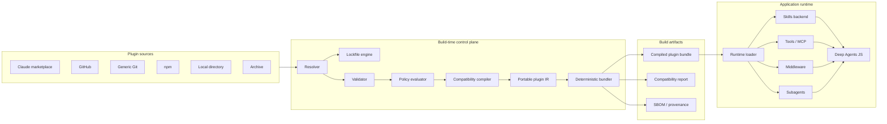
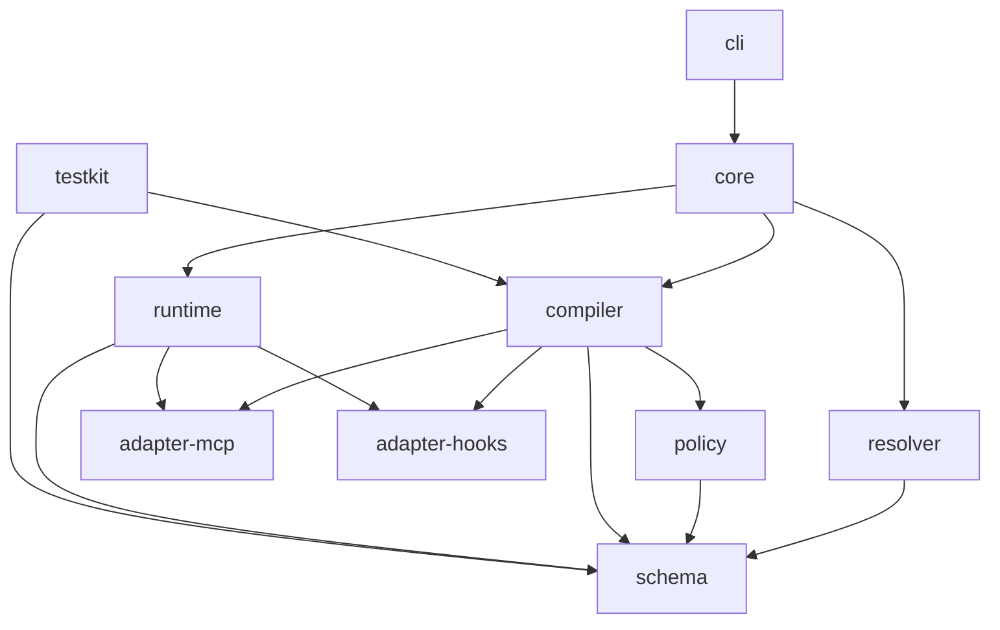
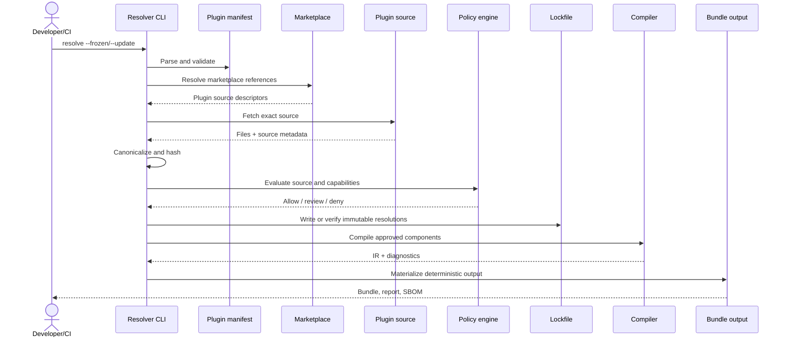
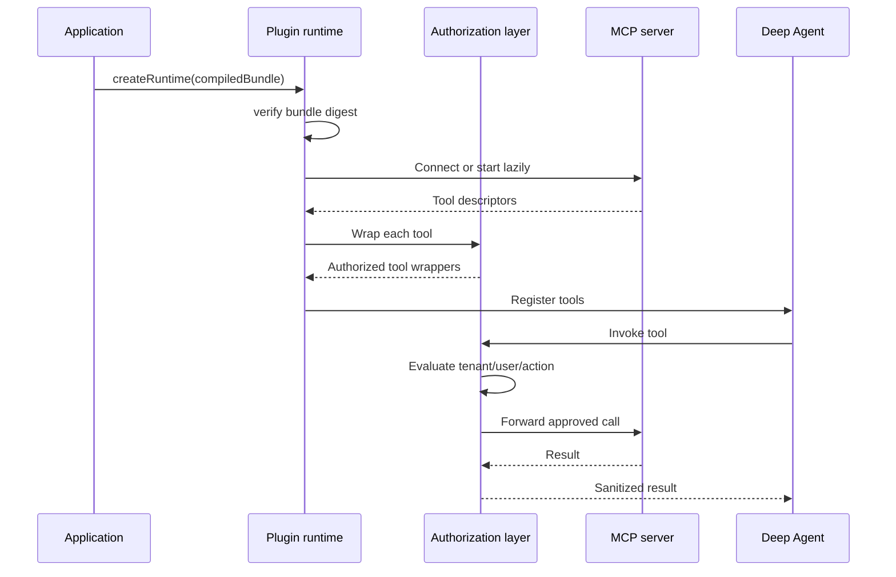
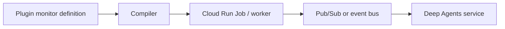
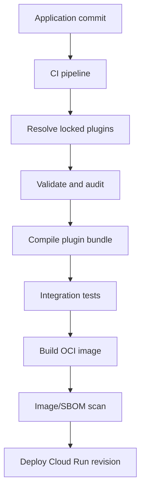
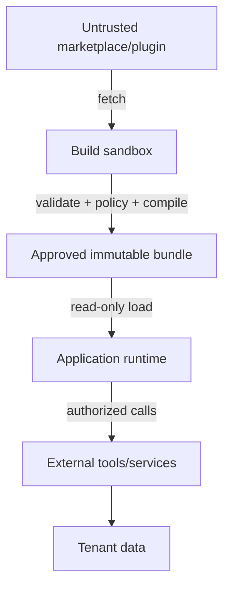
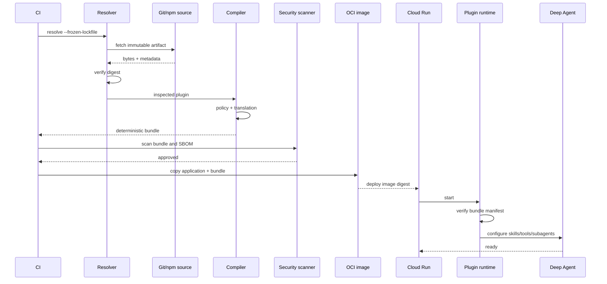

# RFC: Claude Code Plugin Resolution and Compatibility for Deep Agents JS

- **Status:** Proposed
- **Repository:** `yu-iskw/deepagents-plugin-resolver-ts`
- **Target language:** TypeScript
- **Primary runtime:** Node.js
- **Primary agent framework:** `langchain-ai/deepagentsjs`
- **Primary deployment target:** Immutable OCI containers, including Google Cloud Run
- **Last updated:** 2026-07-15
- **Intended audience:** Maintainers, contributors, application developers, platform engineers, security engineers, and plugin authors

---

## 1. Executive Summary

This RFC proposes a TypeScript library and command-line tool that allows applications built with Deep Agents JS to consume compatible capabilities from Claude Code plugins and Claude Code plugin marketplaces.

The project should **not embed or invoke Claude Code as the application runtime**. Instead, it should treat the Claude Code plugin ecosystem as a versioned input and distribution format. At build time, the resolver will:

1. Read a project-owned plugin manifest.
2. Resolve plugins from Claude Code marketplaces, GitHub repositories, generic Git repositories, npm packages, archives, or local directories.
3. Pin all mutable references to immutable versions and integrity digests.
4. Validate plugin structure, metadata, paths, files, and capabilities.
5. Apply an explicit organizational security policy.
6. Translate supported Claude Code components into a stable, vendor-neutral intermediate representation.
7. Materialize all required plugin files into a deterministic output directory suitable for inclusion in an OCI image.
8. Produce a lockfile, compatibility report, provenance metadata, and optional SBOM.

At runtime, a small adapter will load the compiled plugin set and expose:

- Deep Agents skill sources;
- translated subagent definitions;
- MCP tools and connection descriptors;
- safe middleware hooks;
- application command descriptors;
- system-prompt fragments;
- audit and provenance metadata.

The recommended architecture is:



The key architectural principle is:

> **Resolve, validate, and compile untrusted plugins before deployment; load only immutable, policy-approved artifacts at runtime.**

This design supports local development and enterprise deployment while avoiding runtime Git clones, runtime package installation, mutable plugin state, hidden executable hooks, and non-deterministic Cloud Run instances.

---

## 2. Motivation

Deep Agents JS provides an opinionated agent harness with planning, filesystem tools, skills, subagents, middleware, streaming, persistence, and LangGraph integration. Claude Code has developed a substantial plugin ecosystem around reusable skills, subagents, hooks, MCP servers, commands, language servers, monitors, and supporting assets.

Application developers should be able to reuse that ecosystem without:

- rewriting every `SKILL.md`;
- manually translating every subagent definition;
- copying plugin files into application repositories;
- implementing marketplace resolution repeatedly;
- allowing arbitrary plugin code to execute during startup;
- coupling a server application to a user’s `~/.claude` directory;
- requiring Claude Code credentials or CLI installation in production;
- losing reproducibility, provenance, auditability, or supply-chain controls.

The repository is currently empty, making this an opportunity to define a clean compatibility and packaging model from first principles.

---

## 3. Intent and Problem Analysis

### 3.1 Stated problem

Developers want to use Claude Code plugins with Deep Agents JS applications written in TypeScript. Plugins may be discovered through Claude Code marketplaces. When applications are deployed to Cloud Run or a similar platform, the installed plugin files must be included in the container image.

### 3.2 Underlying intent

The deeper goal is to create a portable and secure extension system for Deep Agents applications that can reuse Claude Code ecosystem assets while preserving:

- deterministic builds;
- immutable deployment artifacts;
- application-owned authorization;
- multi-tenant isolation;
- auditability;
- explicit compatibility guarantees;
- extensibility as Claude Code and Deep Agents evolve.

### 3.3 XY-problem assessment

“Load Claude Code plugins in Deep Agents” sounds like a direct runtime integration problem, but it is primarily a **format translation and software supply-chain problem**.

A Claude Code plugin is not a single executable API. It is a directory that may contain components whose semantics are defined by Claude Code itself:

- skills;
- agents;
- hooks;
- MCP configuration;
- settings;
- language-server configuration;
- monitors;
- scripts and binaries;
- arbitrary supporting files.

Some components map naturally to Deep Agents. Others depend on Claude Code lifecycle events, permission modes, variable expansion, command execution behavior, or UI conventions. Claiming full compatibility would therefore be inaccurate.

The product should define a **Claude Code Plugin Compatibility Profile for Deep Agents** and report each component as one of:

- `native`;
- `translated`;
- `partial`;
- `unsupported`;
- `blocked-by-policy`.

---

## 4. Goals

### 4.1 Functional goals

1. Resolve plugins from:
   - Claude Code marketplaces;
   - GitHub repositories;
   - generic Git repositories;
   - npm packages;
   - local directories;
   - local archives;
   - optionally remote archives.

2. Pin mutable references:
   - Git branches and tags to commit SHAs;
   - npm ranges to exact versions and registry integrity values;
   - remote archives to SHA-256 digests.

3. Validate:
   - marketplace manifests;
   - plugin manifests;
   - directory structure;
   - component metadata;
   - paths and symlinks;
   - sizes, counts, and archive expansion;
   - supported compatibility profile.

4. Compile compatible plugin components into a stable intermediate representation.

5. Materialize plugin assets into a deterministic bundle for container inclusion.

6. Integrate compiled output with Deep Agents JS.

7. Produce:
   - a lockfile;
   - diagnostics;
   - a compatibility report;
   - provenance metadata;
   - optional SPDX or CycloneDX SBOM;
   - optional SARIF security findings.

8. Support strict, enterprise, and development policy profiles.

### 4.2 Quality goals

- Strong TypeScript types.
- Stable public API.
- Minimal runtime dependencies.
- Testable pure functions where practical.
- Pluggable source resolvers and component adapters.
- Reproducible output.
- No hidden network access.
- No implicit execution of plugin code.
- Clear error messages and remediation guidance.

---

## 5. Non-Goals

The initial project will not:

1. Reimplement the full Claude Code runtime.
2. Guarantee byte-for-byte behavioral parity with Claude Code.
3. Execute arbitrary plugin hooks by default.
4. Install or update plugins in production containers.
5. Manage end-user Claude Code installations.
6. Provide a general-purpose package manager.
7. Replace npm, Git, OCI registries, or marketplace governance.
8. Automatically grant imported tools access to application secrets.
9. Infer authorization from natural-language plugin instructions.
10. Support durable background monitors inside request-scoped Cloud Run instances.
11. Treat plugin metadata as trusted.
12. expose the application’s global `PATH` to plugin binaries.

---

## 6. Current Upstream Capabilities

### 6.1 Deep Agents JS

Deep Agents JS currently provides:

- `createDeepAgent`;
- custom tools;
- filesystem backends;
- skill loading using the Agent Skills convention;
- subagents;
- middleware;
- MCP integration through LangChain tools;
- streaming and LangGraph execution;
- filesystem permissions;
- optional sandbox execution.

Skills are especially compatible because Deep Agents loads directories containing `SKILL.md` and uses progressive disclosure: metadata is loaded first, and complete instructions are read only when relevant.

### 6.2 Claude Code plugins

Claude Code plugins are self-contained directories that may include:

```text
my-plugin/
├── .claude-plugin/
│   └── plugin.json
├── skills/
│   └── example/
│       ├── SKILL.md
│       └── resources/
├── agents/
│   └── reviewer.md
├── commands/
│   └── review.md
├── hooks/
│   └── hooks.json
├── .mcp.json
├── .lsp.json
├── monitors/
│   └── monitors.json
├── settings.json
├── bin/
└── other supporting assets
```

Not every plugin has every component, and some fields are optional.

### 6.3 Compatibility overview

| Claude Code component    | Deep Agents target            | Initial support | Expected fidelity |
| ------------------------ | ----------------------------- | --------------: | ----------------: |
| `skills/*/SKILL.md`      | Deep Agents skills            |             Yes |              High |
| `commands/*.md`          | Explicit command descriptors  |             Yes |            Medium |
| `agents/*.md`            | Deep Agents subagents         |         Phase 2 |    Medium to high |
| `.mcp.json`              | MCP client/tool descriptors   |         Phase 2 |    Medium to high |
| `hooks/hooks.json`       | Middleware adapters           |         Phase 3 |     Low to medium |
| `settings.json`          | Advisory metadata             |         Limited |               Low |
| `.lsp.json`              | Optional LSP adapter          |           Later |               Low |
| `monitors/monitors.json` | External worker/event adapter |           Later |               Low |
| `bin/`                   | Sandboxed executable assets   |          Opt-in |          Variable |
| Supporting files         | Bundled skill/plugin assets   |             Yes |              High |

---

## 7. Evaluated Architectural Approaches

### 7.1 Approach A: Invoke Claude Code as a subprocess

The application installs Claude Code and launches it with plugin directories.

**Advantages**

- Native Claude Code semantics.
- Minimal translation logic.
- Broad component support.

**Disadvantages**

- Two agent runtimes and two planning loops.
- Authentication and provider coupling.
- Difficult state, streaming, and tool reconciliation.
- Poor multi-tenant isolation.
- High cold-start and image cost.
- Unclear permission ownership.
- Deep Agents becomes largely redundant.

### 7.2 Approach B: Resolve and interpret plugins at application startup

The application resolves marketplaces and plugin sources dynamically.

**Advantages**

- Simple developer workflow.
- Immediate updates.
- No separate build command.

**Disadvantages**

- Network-dependent startup.
- Floating dependencies.
- Runtime credentials for private repositories.
- Inconsistent instances.
- Incomplete SBOMs.
- Increased attack surface.
- Unpredictable cold starts.
- A broken marketplace can prevent service startup.

### 7.3 Approach C: Build-time resolver and compiler

Plugins are resolved and compiled during CI or image construction.

**Advantages**

- Reproducibility.
- Immutable artifacts.
- Strong policy enforcement.
- No runtime source credentials.
- Scan-ready contents.
- Cloud Run compatible.
- Early failure.

**Disadvantages**

- Requires rebuilds for updates.
- Requires lockfile discipline.
- Translation layer must be maintained.

### 7.4 Approach D: Only publish translated npm packages

Each compatible plugin becomes an npm package.

**Advantages**

- Familiar dependency management.
- Excellent TypeScript UX.
- npm integrity and provenance.
- Easy bundling.

**Disadvantages**

- Cannot consume arbitrary marketplaces directly.
- Republishing and licensing concerns.
- Translation packages can drift.
- Large maintenance burden.

### 7.5 Approach E: Build-time compiler plus optional precompiled npm adapters

A general resolver handles arbitrary supported sources, while selected plugins may publish optimized npm adapters that generate the same IR.

**Advantages**

- Broad compatibility.
- Strong deployment properties.
- Supports first-class adapters.
- Extensible ecosystem.
- Single runtime model.

**Disadvantages**

- Highest initial design complexity.
- Requires an explicit IR and compatibility contract.

### 7.6 Scoring matrix

| Approach                   | Fidelity | Security | Reproducibility | Developer experience | Cloud deployment | Maintainability | Extensibility | Weighted result |
| -------------------------- | -------: | -------: | --------------: | -------------------: | ---------------: | --------------: | ------------: | --------------: |
| A. Claude subprocess       |       95 |       38 |              58 |                   45 |               34 |              42 |            48 |              54 |
| B. Runtime interpretation  |       70 |       42 |              39 |                   74 |               51 |              57 |            82 |              58 |
| C. Build-time compiler     |       76 |       91 |              96 |                   80 |               95 |              86 |            87 |              86 |
| D. npm-only translations   |       81 |       88 |              95 |                   93 |               97 |              69 |            67 |              84 |
| E. Compiler + npm adapters |       88 |       93 |              97 |                   92 |               97 |              89 |            96 |          **93** |

### 7.7 Decision

Adopt **Approach E**, with the build-time compiler as the canonical architecture and npm adapters as an optional optimization.

---

## 8. Proposed Package Architecture

The repository should begin as a TypeScript monorepo.

```text
deepagents-plugin-resolver-ts/
├── packages/
│   ├── schema/
│   ├── core/
│   ├── resolver/
│   ├── compiler/
│   ├── policy/
│   ├── runtime/
│   ├── cli/
│   ├── adapter-mcp/
│   ├── adapter-hooks/
│   └── testkit/
├── examples/
│   ├── basic-skills/
│   ├── marketplace/
│   ├── cloud-run/
│   └── custom-adapter/
├── fixtures/
│   ├── marketplaces/
│   ├── plugins/
│   ├── malicious/
│   └── golden/
├── docs/
│   ├── architecture/
│   ├── compatibility/
│   ├── security/
│   └── adr/
└── RFC.md
```

### 8.1 Package responsibilities

| Package       | npm name                            | Responsibility                         |
| ------------- | ----------------------------------- | -------------------------------------- |
| Schema        | `@deepagents-plugins/schema`        | Zod schemas and shared types           |
| Core          | `@deepagents-plugins/core`          | Stable facade and convenience APIs     |
| Resolver      | `@deepagents-plugins/resolver`      | Source and marketplace resolution      |
| Compiler      | `@deepagents-plugins/compiler`      | Translation into portable IR           |
| Policy        | `@deepagents-plugins/policy`        | Capability and source policy           |
| Runtime       | `@deepagents-plugins/runtime`       | Load compiled bundles into Deep Agents |
| CLI           | `@deepagents-plugins/cli`           | User-facing commands                   |
| MCP adapter   | `@deepagents-plugins/adapter-mcp`   | MCP descriptor and tool construction   |
| Hooks adapter | `@deepagents-plugins/adapter-hooks` | Safe lifecycle translation             |
| Testkit       | `@deepagents-plugins/testkit`       | Fixtures and conformance tests         |

### 8.2 Dependency direction



Rules:

- `runtime` must not depend on Git clients, npm registry clients, archive downloaders, or marketplace resolvers.
- `schema` must be environment-neutral.
- adapters may depend on LangChain-specific packages only when required.
- the CLI may aggregate all build-time packages.
- optional capabilities should use peer dependencies or dynamically loaded adapters.

---

## 9. Configuration Model

### 9.1 Project manifest

The project-owned manifest declares desired plugins and trusted marketplaces.

```yaml
# deepagents.plugins.yaml
apiVersion: deepagents.plugins/v1
kind: PluginSet

metadata:
  name: support-agent-plugins

marketplaces:
  - name: anthropic-official
    source:
      type: github
      repository: anthropics/claude-plugins-official
      ref: main

plugins:
  - id: example-plugin@anthropic-official
    policyProfile: third-party-restricted

  - id: internal-security
    source:
      type: npm
      package: '@acme/claude-security-plugin'
      version: '2.3.1'
    policyProfile: trusted-internal

  - id: project-local
    source:
      type: local
      path: './plugins/project-local'
    policyProfile: development

output:
  directory: '.deepagents/plugins'
  reproducible: true
  includeSourceFiles: true
  emitCompatibilityReport: true
  emitSbom: true
```

### 9.2 Design principles

- Configuration contains user intent.
- Lockfile contains resolution results.
- Compiled IR contains runtime semantics.
- Policy remains application-owned.
- No plugin may modify its assigned policy profile.
- Environment variables may provide credentials but must not alter immutable resolution in frozen mode.

---

## 10. Lockfile

### 10.1 Purpose

The lockfile ensures that a plugin set is reproducible even when manifests contain branches, tags, ranges, or marketplace aliases.

### 10.2 Example

```json
{
  "lockfileVersion": 1,
  "resolverVersion": "0.1.0",
  "pluginSetDigest": "sha256:...",
  "marketplaces": [
    {
      "name": "anthropic-official",
      "source": {
        "type": "github",
        "repository": "anthropics/claude-plugins-official",
        "requestedRef": "main",
        "resolvedCommit": "0123456789abcdef..."
      },
      "contentDigest": "sha256:..."
    }
  ],
  "plugins": [
    {
      "id": "example-plugin@anthropic-official",
      "version": "1.4.0",
      "source": {
        "type": "git",
        "url": "https://github.com/example/plugin.git",
        "requestedRef": "v1.4.0",
        "resolvedCommit": "fedcba9876543210..."
      },
      "pluginRoot": ".",
      "contentDigest": "sha256:...",
      "manifestDigest": "sha256:...",
      "files": {
        "skills/review/SKILL.md": "sha256:..."
      }
    }
  ]
}
```

### 10.3 Rules

- Git sources must resolve to a full commit SHA.
- npm sources must record exact version, tarball URL identity, and registry integrity.
- archives must record SHA-256.
- local sources should record content digests but are not globally reproducible unless committed with the project.
- lockfile entries must be sorted deterministically.
- timestamps must not affect digests.
- frozen mode must fail on any mismatch.

---

## 11. Resolution Pipeline



### 11.1 Resolution phases

1. **Parse**
   - Read configuration.
   - Expand no implicit shell expressions.
   - Validate schema.

2. **Discover**
   - Resolve marketplace aliases.
   - Locate plugin definitions.

3. **Resolve**
   - Convert mutable references into immutable identities.

4. **Fetch**
   - Download or copy source into an isolated temporary directory.

5. **Normalize**
   - Normalize path separators.
   - remove transport metadata;
   - establish canonical plugin root.

6. **Inspect**
   - enumerate files without executing them;
   - parse manifest and components;
   - collect capabilities.

7. **Verify**
   - validate digests;
   - compare against lockfile;
   - enforce source and content constraints.

8. **Policy**
   - classify capabilities;
   - block prohibited features.

9. **Compile**
   - translate to IR;
   - emit diagnostics.

10. **Bundle**
    - copy approved assets;
    - write manifests;
    - calculate bundle digest.

---

## 12. Source Resolver Interface

```ts
export interface PluginSourceResolver<TSpec extends PluginSourceSpec> {
  readonly type: TSpec['type'];

  canResolve(spec: PluginSourceSpec): spec is TSpec;

  resolve(spec: TSpec, context: ResolveContext): Promise<ResolvedPluginSource>;

  fetch(
    resolved: ResolvedPluginSource,
    destination: AbsolutePath,
    context: FetchContext,
  ): Promise<FetchedPluginSource>;
}
```

### 12.1 Common source result

```ts
export interface ResolvedPluginSource {
  sourceType: string;
  requested: PluginSourceSpec;
  immutableIdentity: string;
  version?: string;
  uri: string;
  expectedIntegrity?: string;
  metadata: Record<string, string>;
}
```

### 12.2 Built-in resolvers

- `LocalDirectoryResolver`
- `LocalArchiveResolver`
- `GitHubResolver`
- `GitResolver`
- `NpmResolver`
- `RemoteArchiveResolver` — optional and disabled by strict policy
- `MarketplaceResolver` — resolves marketplace entries to one of the above

### 12.3 GitHub behavior

The GitHub resolver should support:

- public repositories;
- private repositories through explicit credentials;
- GitHub Enterprise Server;
- repository subdirectories;
- tags and branches resolved to commits;
- source archives or shallow Git fetches.

It should not rely on GitHub release assets unless the source explicitly requests one.

### 12.4 npm behavior

The npm resolver should:

- use the configured registry;
- resolve semver to an exact version;
- verify `dist.integrity`;
- extract with strict path handling;
- find the plugin root according to manifest configuration;
- avoid lifecycle scripts;
- never run `npm install` merely to inspect a plugin.

---

## 13. Marketplace Resolution

### 13.1 Marketplace role

A Claude Code marketplace is a catalog, not a trust authority. The resolver must independently validate every referenced plugin.

### 13.2 Marketplace precedence

Recommended precedence:

1. Explicit plugin source in project manifest.
2. Project-declared marketplace.
3. Organization-configured marketplace.
4. No implicit public fallback.

### 13.3 Name collision policy

A canonical plugin identifier should be:

```text
<plugin-name>@<marketplace-name>
```

For direct sources:

```text
<plugin-name>@direct
```

The compiled runtime namespace should include a stable, normalized plugin name. Collisions must fail unless an explicit alias is configured.

```yaml
plugins:
  - id: review-tools@marketplace-a
    alias: review-tools-a
```

### 13.4 Marketplace trust

Policies may restrict:

- marketplace source owners;
- allowed repository organizations;
- allowed npm scopes;
- minimum provenance level;
- whether floating marketplace references are permitted during update;
- whether transitive source redirects are allowed.

---

## 14. Validation

### 14.1 Structural validation

Validate:

- plugin manifest JSON;
- marketplace JSON;
- required directories;
- duplicate component names;
- invalid or reserved names;
- unsupported files;
- unknown component fields, depending on strictness.

### 14.2 Filesystem validation

Reject:

- `..` path traversal;
- absolute paths in archives;
- Windows drive paths;
- UNC paths;
- symlinks or hard links escaping extraction root;
- device files;
- FIFOs and sockets;
- case-collision ambiguities;
- Unicode normalization collisions;
- duplicate archive entries;
- excessively long paths;
- excessive file counts;
- excessive expanded size;
- decompression bombs.

### 14.3 Content limits

Suggested defaults:

| Constraint                 |    Default |
| -------------------------- | ---------: |
| Total plugin expanded size |    100 MiB |
| Individual file size       |     20 MiB |
| `SKILL.md` size            |     10 MiB |
| File count                 |     10,000 |
| Directory depth            |         32 |
| Marketplace entries        |     10,000 |
| Redirect count             |          3 |
| Network timeout            | 60 seconds |

All limits should be configurable downward by policy.

### 14.4 Parsing safety

- Use safe YAML parsing with custom tags disabled.
- Parse JSON without evaluation.
- Treat Markdown as text.
- Never execute code during inspection.
- Never render untrusted HTML during CLI output.
- redact credentials from error messages.

---

## 15. Portable Intermediate Representation

### 15.1 Why an IR is necessary

Directly parsing Claude plugin files in the runtime would couple production applications to upstream format changes. A stable IR allows:

- compiler evolution independent of runtime;
- deterministic runtime loading;
- precompiled npm adapters;
- schema migration;
- compatibility diagnostics;
- policy annotations;
- alternative source ecosystems in the future.

### 15.2 Top-level schema

```ts
export interface CompiledPluginSetV1 {
  schemaVersion: '1.0';
  generatedBy: {
    name: string;
    version: string;
  };
  pluginSetDigest: string;
  plugins: CompiledPluginV1[];
  skills: CompiledSkillV1[];
  commands: CompiledCommandV1[];
  subagents: CompiledSubagentV1[];
  mcpServers: CompiledMcpServerV1[];
  hooks: CompiledHookV1[];
  assets: CompiledAssetV1[];
  diagnostics: CompatibilityDiagnosticV1[];
  provenance: ProvenanceRecordV1[];
}
```

### 15.3 Plugin record

```ts
export interface CompiledPluginV1 {
  id: string;
  runtimeNamespace: string;
  name: string;
  version?: string;
  description?: string;
  license?: string;
  source: LockedSourceV1;
  contentDigest: string;
  policyProfile: string;
  capabilities: PluginCapability[];
  compatibility: 'native' | 'translated' | 'partial' | 'unsupported';
}
```

### 15.4 Diagnostic model

```ts
export interface CompatibilityDiagnosticV1 {
  code: string;
  severity: 'info' | 'warning' | 'error';
  pluginId: string;
  component?: string;
  compatibility: 'native' | 'translated' | 'partial' | 'unsupported' | 'blocked-by-policy';
  message: string;
  remediation?: string;
  sourceLocation?: {
    path: string;
    line?: number;
    column?: number;
  };
}
```

### 15.5 Evolution rules

- IR patch versions may add optional fields.
- Minor versions may add component types.
- Major versions may change semantics.
- The runtime should support at least the current and previous major IR versions.
- Migrations should be pure and deterministic.
- Unknown required fields must fail closed.

---

## 16. Component Translation

## 16.1 Skills

### Mapping

Claude Code:

```text
skills/<name>/SKILL.md
```

Deep Agents:

```ts
createDeepAgent({
  skills: ['/compiled/plugins/<plugin>/skills'],
});
```

### Compilation behavior

The compiler should:

1. Parse frontmatter.
2. Validate the Agent Skills-compatible subset.
3. Normalize names.
4. preserve full instructions;
5. copy supporting assets;
6. rewrite only resolver-owned path references when necessary;
7. record unsupported Claude-specific fields.

### Namespacing

Claude Code names plugin skills using plugin namespace. Deep Agents skill selection may use skill metadata and directory names. To avoid collisions, the bundle should use:

```text
/skills/<plugin-runtime-namespace>/<skill-name>/SKILL.md
```

The IR should preserve both:

- original skill name;
- runtime-qualified name.

Possible runtime representations:

```ts
interface CompiledSkillV1 {
  id: string; // "plugin:skill"
  pluginId: string;
  originalName: string;
  runtimeName: string;
  description: string;
  directory: string;
  skillFile: string;
  allowedTools?: string[];
  compatibility: CompatibilityLevel;
}
```

### Claude-specific variables

Variables such as `$ARGUMENTS` should not be silently left ambiguous. The compiler can support:

- explicit command invocation path with arguments;
- a documented template expansion step;
- diagnostic when a skill depends on Claude-only variables.

Automatic, model-triggered skills should not receive arbitrary user arguments unless the host application explicitly supplies them.

---

## 16.2 Commands

Commands are better modeled as **application entry points**, not ordinary automatically selected skills.

```ts
export interface CompiledCommandV1 {
  id: string;
  pluginId: string;
  name: string;
  description?: string;
  promptTemplate: string;
  argumentSchema?: JsonSchema;
  requiredSkills?: string[];
}
```

Runtime API:

```ts
await runtime.invokeCommand(agent, {
  command: 'security:review',
  arguments: {
    target: 'src/auth.ts',
  },
});
```

Commands should not all be injected into the system prompt. Applications may expose them through:

- HTTP endpoints;
- chat slash commands;
- UI actions;
- internal workflows;
- automation jobs.

---

## 16.3 Subagents

Claude plugin agents should compile into Deep Agents subagent definitions.

```ts
export interface CompiledSubagentV1 {
  id: string;
  pluginId: string;
  name: string;
  description: string;
  systemPrompt: string;
  model?: ModelSelectorV1;
  allowedTools?: string[];
  skillIds?: string[];
  middlewareIds?: string[];
  compatibility: CompatibilityLevel;
}
```

### Translation rules

- Description becomes selection metadata.
- Markdown body becomes system prompt.
- Tool lists become requested tool capabilities.
- Requested tools are intersected with host policy.
- Model declarations are advisory and resolved by the host.
- Claude permission modes never weaken host authorization.
- Plugin-specified environment variables are references, not values.
- Subagent filesystem access is explicitly scoped.

### Security rule

```text
effectiveSubagentTools =
    pluginRequestedTools
  ∩ applicationAvailableTools
  ∩ policyAllowedTools
  ∩ callerAuthorizedTools
```

---

## 16.4 MCP servers

### Compiled descriptor

```ts
export interface CompiledMcpServerV1 {
  id: string;
  pluginId: string;
  transport: 'streamable-http' | 'sse' | 'stdio';
  endpoint?: string;
  commandAssetId?: string;
  args?: string[];
  environmentRefs?: string[];
  toolAllowlist?: string[];
  authProfile?: string;
  startupPolicy?: 'eager' | 'lazy';
}
```

### Transport priorities

1. Streamable HTTP.
2. Managed remote MCP service.
3. SSE where required.
4. Sandboxed stdio for trusted, bundled executables.

### Runtime sequence



### Required controls

- Never pass all application environment variables to stdio servers.
- Resolve secrets by named secret references.
- Apply per-tool authorization.
- enforce timeouts and output limits;
- sanitize logs;
- expose provenance in traces;
- disable dynamic tool mutation unless explicitly supported.

---

## 16.5 Hooks

Claude Code hooks are lifecycle-specific. The project should define a smaller portable lifecycle:

```ts
export type PortableHookEventV1 =
  | 'beforeAgentInvoke'
  | 'afterAgentInvoke'
  | 'beforeToolCall'
  | 'afterToolCall'
  | 'onToolError'
  | 'beforeSubagentInvoke'
  | 'afterSubagentInvoke';
```

### Hook action types

```ts
export type CompiledHookActionV1 =
  | {
      type: 'middleware';
      adapter: string;
      config: unknown;
    }
  | {
      type: 'webhook';
      endpointRef: string;
      payloadTemplate?: string;
    }
  | {
      type: 'command';
      executableAssetId: string;
      args: string[];
      sandboxProfile: string;
    }
  | {
      type: 'unsupported';
      reason: string;
    };
```

### Default policy

| Hook type                                       | Default |
| ----------------------------------------------- | ------- |
| Pure TypeScript middleware from trusted adapter | Allow   |
| Declarative policy check                        | Allow   |
| Outbound webhook                                | Review  |
| Bundled command                                 | Deny    |
| Shell string                                    | Deny    |
| Dynamically downloaded executable               | Deny    |

### Translation principle

Do not map by name alone. Validate payload and control-flow semantics. A Claude event that can block a tool call may map to `beforeToolCall`; a notification-only event cannot be treated as an authorization hook.

---

## 16.6 Settings

Plugin settings are advisory. They may propose:

- default subagent;
- display metadata;
- optional behavior flags.

They may not:

- replace application authorization;
- select unrestricted tools;
- override tenant boundaries;
- change persistence;
- expose secrets;
- enable blocked hooks;
- force a model provider;
- modify global runtime configuration.

---

## 16.7 LSP servers

LSP support should be optional and later.

Requirements:

- explicit adapter package;
- bundled or externally managed server;
- workspace-scoped filesystem;
- process sandbox;
- CPU/memory/time limits;
- no ambient credentials;
- no global package installation.

For server applications not editing repositories, LSP configuration should be ignored with a diagnostic.

---

## 16.8 Monitors

Background monitors do not fit request-oriented Cloud Run instances.

Recommended translation:



Initial behavior: mark monitors unsupported.

Future behavior: generate external worker descriptors, never silently run an infinite process in the web service container.

---

## 16.9 Executable assets

Executable assets require an explicit descriptor:

```ts
export interface CompiledExecutableAssetV1 {
  id: string;
  pluginId: string;
  relativePath: string;
  sha256: string;
  platform?: {
    os?: string[];
    arch?: string[];
  };
  allowedArguments?: string[];
  sandboxProfile: string;
}
```

Rules:

- no global `PATH` modification;
- invoke by absolute bundle path;
- verify digest before execution;
- use a sandbox;
- set a minimal environment;
- enforce timeouts;
- cap stdout/stderr;
- disable network by default;
- log invocation metadata without secrets.

---

## 17. Policy Engine

### 17.1 Policy example

```yaml
apiVersion: deepagents.plugins/v1
kind: PluginPolicy

defaults:
  sourceTrust: untrusted
  skills: allow
  commands: allow
  subagents: review
  mcp:
    remoteHttp: review
    stdio: deny
  hooks:
    middleware: allow
    webhook: review
    command: deny
  lsp: deny
  monitors: deny
  binaries: deny
  unknownComponents: deny

profiles:
  trusted-internal:
    source:
      npmScopes:
        - '@acme'
      githubOwners:
        - 'acme'
    subagents: allow
    mcp:
      remoteHttp: allow
      stdio: review
    hooks:
      middleware: allow
      webhook: allow
      command: review

  third-party-restricted:
    skills: allow
    commands: allow
    subagents: review
    mcp:
      remoteHttp: review
      stdio: deny
```

### 17.2 Decision model

```ts
export interface PolicyDecision {
  effect: 'allow' | 'review' | 'deny';
  ruleId: string;
  reason: string;
  remediation?: string;
}
```

`review` should fail in unattended strict builds unless an approval record is supplied.

### 17.3 Approval records

Enterprise CI can use signed approvals:

```yaml
apiVersion: deepagents.plugins/v1
kind: PluginApproval
pluginDigest: 'sha256:...'
approvedCapabilities:
  - 'mcp.remoteHttp'
approvedBy: 'security-platform@example.com'
expiresAt: '2027-01-01T00:00:00Z'
```

Approval must bind to content digest, not merely plugin name or version.

---

## 18. Runtime API

### 18.1 Low-level API

```ts
import { loadCompiledPluginSet, createPluginRuntime } from '@deepagents-plugins/runtime';

const compiled = await loadCompiledPluginSet({
  directory: process.env.DEEPAGENTS_PLUGIN_DIR!,
  verifyIntegrity: true,
});

const runtime = await createPluginRuntime({
  compiled,
  secretResolver,
  authorization,
  telemetry,
});

const agent = await createDeepAgent({
  model,
  backend: runtime.backend,
  skills: runtime.skillSources,
  tools: [...applicationTools, ...runtime.tools],
  middleware: [...securityMiddleware, ...runtime.middleware],
  subagents: runtime.subagents,
  systemPrompt: {
    prefix: runtime.systemPromptPrefix,
  },
});
```

### 18.2 Convenience API

```ts
import { createPluginEnabledDeepAgent } from '@deepagents-plugins/core';

const agent = await createPluginEnabledDeepAgent({
  model,
  applicationTools,
  plugins: {
    directory: '/app/.deepagents/plugins',
    verifyIntegrity: true,
  },
  security: {
    authorization,
    secretResolver,
  },
});
```

### 18.3 Runtime invariants

- no network source resolution;
- no npm installation;
- no Git operations;
- no plugin mutation;
- no policy escalation;
- no executable hook without explicit adapter;
- bundle verification before use;
- application tools take precedence unless collision policy says otherwise.

---

## 19. Tool and Namespace Collision Handling

### 19.1 Tool identity

Use fully qualified internal IDs:

```text
plugin.<plugin-namespace>.<tool-name>
```

The model-visible name may be shortened only if collision-free and policy-approved.

### 19.2 Collision options

```yaml
collisionPolicy:
  tools: error
  skills: qualify
  subagents: qualify
  commands: qualify
```

### 19.3 Reserved namespaces

Reserve:

- `deepagents.*`
- `application.*`
- `system.*`
- `plugin.*`

Plugins must not impersonate built-in tools or middleware.

---

## 20. Cloud Run Deployment

### 20.1 Recommended build process



### 20.2 Dockerfile

```dockerfile
FROM node:24-bookworm-slim AS build

WORKDIR /workspace

COPY package.json package-lock.json ./
RUN npm ci

COPY deepagents.plugins.yaml deepagents.plugins.lock.json ./
COPY plugin-policy.yaml ./
COPY src ./src
COPY tsconfig.json ./

RUN npx deepagents-plugins verify --frozen-lockfile

RUN npx deepagents-plugins compile \
    --config deepagents.plugins.yaml \
    --lockfile deepagents.plugins.lock.json \
    --policy plugin-policy.yaml \
    --output /workspace/.deepagents/plugins \
    --reproducible

RUN npm run build
RUN npm prune --omit=dev

FROM gcr.io/distroless/nodejs24-debian12:nonroot

WORKDIR /app

COPY --from=build /workspace/node_modules ./node_modules
COPY --from=build /workspace/dist ./dist
COPY --from=build /workspace/.deepagents/plugins ./.deepagents/plugins
COPY --from=build /workspace/package.json ./

ENV NODE_ENV=production
ENV DEEPAGENTS_PLUGIN_DIR=/app/.deepagents/plugins

CMD ["dist/server.js"]
```

### 20.3 Cloud Run constraints

The design assumes:

- filesystem writes are ephemeral;
- instances scale independently;
- startup should not depend on mutable external plugin sources;
- a revision should be reproducible from image digest;
- credentials should come from workload identity and Secret Manager;
- private Git/npm credentials should exist only during controlled build stages;
- plugin updates produce a new image and revision.

### 20.4 Multi-tenant services

Do not compile a different untrusted plugin set per request into the same service process.

Recommended models:

1. **Static shared set**
   - one reviewed plugin set for the service.

2. **Tenant-specific revisions**
   - separate image or deployment per tenant.

3. **Sandbox workers**
   - dynamically selected plugins execute in isolated worker environments.

4. **Remote MCP**
   - tenant extensions run as separately governed MCP services.

---

## 21. Security Threat Model

### 21.1 Trust boundaries



### 21.2 Threats and mitigations

| Threat                      | Mitigation                                                    |
| --------------------------- | ------------------------------------------------------------- |
| Path traversal              | Canonical path checks and safe extraction                     |
| Symlink escape              | Reject external targets                                       |
| Git tag retargeting         | Pin commit SHA                                                |
| npm dependency substitution | Verify exact version and integrity                            |
| Archive replacement         | SHA-256 lock                                                  |
| Plugin prompt injection     | Provenance, scoped skills, policy-owned tools                 |
| Hidden telemetry hook       | Hook deny-by-default and static inspection                    |
| Shell injection             | No shell strings; typed arguments                             |
| Credential theft            | Minimal environment and secret references                     |
| Tool privilege escalation   | Authorization wrapper around every imported tool              |
| Cross-tenant data access    | Tenant context enforced outside plugin                        |
| MCP server impersonation    | Endpoint allowlist, TLS, auth profile, pinning where possible |
| Output flooding             | Tool result size limits                                       |
| Resource exhaustion         | file, process, CPU, memory, and timeout limits                |
| Malicious update            | digest-bound approvals and lockfile review                    |
| Namespace spoofing          | qualified identifiers and reserved namespaces                 |
| Parser exploit              | dependency hygiene, fuzzing, safe parsers                     |
| Build credential leakage    | isolated build step and log redaction                         |

### 21.3 Prompt-level controls

Plugin instructions are untrusted content. They must not be able to:

- grant themselves tools;
- override application policy;
- obtain secret values directly;
- suppress audit logs;
- redefine system messages;
- alter tenant identity.

The runtime should annotate prompts with provenance internally and preserve plugin/component IDs in traces.

---

## 22. Supply-Chain Security

Recommended controls:

- exact Git SHAs;
- npm integrity verification;
- Sigstore/npm provenance when available;
- SLSA provenance for published packages;
- SBOM for library and compiled plugin bundle;
- dependency review;
- vulnerability scanning;
- secret scanning;
- malware scanning of executable assets;
- license detection;
- digest-bound review records;
- reproducible archive creation;
- signed releases;
- protected release workflow;
- GitHub Actions pinned to full commit SHAs.

### 22.1 Bundle manifest

```json
{
  "schemaVersion": 1,
  "bundleDigest": "sha256:...",
  "files": [
    {
      "path": "ir/plugin-set.json",
      "sha256": "..."
    },
    {
      "path": "skills/example/review/SKILL.md",
      "sha256": "..."
    }
  ]
}
```

Runtime verification should stream-hash files and fail closed on mismatch.

---

## 23. Observability and Auditability

### 23.1 Trace attributes

Recommended OpenTelemetry attributes:

```text
deepagents.plugin.id
deepagents.plugin.version
deepagents.plugin.digest
deepagents.plugin.component.type
deepagents.plugin.component.id
deepagents.plugin.compatibility
deepagents.plugin.policy.profile
deepagents.plugin.policy.decision
deepagents.plugin.source.type
deepagents.plugin.source.identity
```

### 23.2 Audit events

- plugin bundle loaded;
- integrity verified;
- MCP server connected;
- plugin tool registered;
- plugin tool invoked;
- authorization allowed or denied;
- hook triggered;
- executable asset invoked;
- runtime diagnostic emitted.

### 23.3 Redaction

Do not log:

- secret values;
- authorization tokens;
- full sensitive prompts by default;
- complete tool payloads without policy;
- private repository credentials;
- environment contents.

---

## 24. CLI

### 24.1 Commands

```bash
deepagents-plugins init
deepagents-plugins add <plugin>
deepagents-plugins remove <plugin>
deepagents-plugins resolve
deepagents-plugins update [plugin]
deepagents-plugins verify
deepagents-plugins validate
deepagents-plugins audit
deepagents-plugins compile
deepagents-plugins explain <plugin>
deepagents-plugins list
deepagents-plugins sbom
deepagents-plugins doctor
```

### 24.2 Important flags

```text
--frozen-lockfile
--offline
--policy <path>
--strict
--compatibility <permissive|standard|strict>
--output <path>
--json
--sarif
--reproducible
--allow-local
--cache-dir <path>
```

### 24.3 Exit codes

| Code | Meaning                     |
| ---: | --------------------------- |
|    0 | Success                     |
|    1 | General failure             |
|    2 | Configuration/schema error  |
|    3 | Resolution failure          |
|    4 | Integrity mismatch          |
|    5 | Policy denial               |
|    6 | Compatibility failure       |
|    7 | Security validation failure |
|    8 | Offline cache miss          |

---

## 25. Deterministic Builds

The compiler must produce identical output for identical:

- configuration;
- lockfile;
- policy;
- source bytes;
- compiler version and relevant options.

Requirements:

- stable JSON key ordering;
- stable file ordering;
- normalized line endings where explicitly defined;
- fixed archive timestamps;
- no current timestamps in hashed artifacts;
- normalized file modes;
- no absolute build paths;
- no hostnames or usernames;
- deterministic diagnostics ordering.

A separate non-hashed metadata file may record build time.

---

## 26. Caching

### 26.1 Content-addressed cache

```text
~/.cache/deepagents-plugins/
├── sources/
│   └── sha256/<digest>/
├── marketplaces/
├── compiled/
│   └── sha256/<digest>/
└── metadata/
```

### 26.2 Cache safety

- verify cache contents before use;
- do not trust path names alone;
- separate credentials from cached content;
- allow read-only shared CI cache;
- support offline frozen builds;
- implement bounded cleanup.

---

## 27. Error and Diagnostic Design

Errors should identify:

- plugin;
- source;
- component;
- path;
- violated rule;
- compatibility level;
- remediation.

Example:

```text
DAP2304 [blocked-by-policy]
Plugin: analytics-tools@third-party
Component: hooks/hooks.json
Path: hooks[2].command

Command hooks are denied by policy profile "third-party-restricted".
The hook would execute: ./bin/upload-telemetry

Remediation:
- remove the command hook;
- provide a reviewed TypeScript middleware adapter; or
- approve the exact plugin digest under a stricter sandbox profile.
```

---

## 28. Public TypeScript API Stability

### 28.1 API layers

1. Stable facade:
   - `@deepagents-plugins/core`
   - `@deepagents-plugins/runtime`

2. Extensible interfaces:
   - resolver plugins;
   - compiler adapters;
   - policy providers.

3. Internal implementation:
   - undocumented modules;
   - no compatibility guarantee.

### 28.2 Versioning

Use semantic versioning. Breaking changes include:

- IR semantic changes;
- resolver interface changes;
- default policy becoming less restrictive;
- runtime behavior changes that alter authorization;
- lockfile incompatible changes.

A more restrictive security default may be released in a minor version when accompanied by clear diagnostics, but should be documented prominently.

---

## 29. Testing Strategy

### 29.1 Unit tests

- schemas;
- source canonicalization;
- semver resolution;
- lockfile generation;
- path validation;
- digest calculation;
- policy evaluation;
- component translation;
- collision handling;
- deterministic serialization.

### 29.2 Golden tests

```text
fixtures/plugins/example/
fixtures/golden/example/
├── plugin-set.json
├── compatibility.json
├── bundle-manifest.json
└── expected-tree.txt
```

### 29.3 Integration tests

- resolve public GitHub marketplace;
- resolve private GitHub fixture;
- resolve npm fixture;
- frozen offline rebuild;
- compile skills;
- create Deep Agent with compiled skills;
- translated subagent invocation;
- MCP tool registration;
- denied hook;
- container build and execution.

### 29.4 Security tests

- Zip Slip;
- tar symlink escape;
- duplicate archive entries;
- Unicode path collision;
- case-insensitive collision;
- archive bomb;
- malformed YAML;
- huge frontmatter;
- shell metacharacters;
- poisoned Git submodule;
- malicious npm lifecycle script;
- tampered cache;
- tampered lockfile;
- tampered bundle;
- credential redaction.

### 29.5 Fuzzing

Fuzz:

- marketplace parser;
- plugin manifest parser;
- archive path normalization;
- skill frontmatter parser;
- hook parser;
- lockfile parser;
- IR migrations.

### 29.6 Compatibility test corpus

Maintain fixtures from:

- official Claude plugins;
- representative community plugins;
- skills-only plugins;
- MCP-heavy plugins;
- intentionally unsupported plugins;
- malicious synthetic plugins.

Do not redistribute third-party fixtures when licenses prohibit it; fetch pinned fixtures in controlled tests or create structurally equivalent samples.

---

## 30. CI/CD

Recommended jobs:

1. Format and lint.
2. Type check.
3. Unit tests.
4. Integration tests.
5. Fuzz smoke tests.
6. Dependency review.
7. Secret scanning.
8. SAST.
9. License checks.
10. SBOM generation.
11. Package provenance.
12. Reproducibility comparison.
13. Example Cloud Run image build.
14. API compatibility check.

Release packages through npm trusted publishing or equivalent OIDC-based provenance, avoiding long-lived npm tokens.

---

## 31. Phased Delivery

### Phase 0: Foundation

- monorepo;
- package boundaries;
- schemas;
- diagnostics;
- hashing;
- deterministic filesystem utilities;
- security test fixtures.

### Phase 1: Skills-first MVP

Support:

- local directory;
- GitHub;
- generic Git;
- npm;
- marketplace parsing;
- lockfile;
- plugin manifest;
- skills;
- commands;
- bundle output;
- runtime skill integration;
- compatibility report.

Explicitly unsupported:

- hooks;
- monitors;
- LSP;
- binaries;
- stdio MCP.

### Phase 2: Subagents and remote MCP

- subagent translation;
- Streamable HTTP MCP;
- tool wrappers;
- secret references;
- authorization interface;
- telemetry.

### Phase 3: Hook adapter framework

- portable lifecycle;
- pure middleware adapters;
- declarative hooks;
- webhooks;
- command hooks remain denied by default.

### Phase 4: Sandboxed execution

- stdio MCP;
- executable assets;
- sandbox provider interface;
- resource controls;
- platform-specific artifacts.

### Phase 5: Enterprise ecosystem

- signed bundles;
- approval records;
- private catalogs;
- policy distribution;
- organization allowlists;
- provenance verification;
- generated admission reports.

---

## 32. Recommended Initial Repository Decisions

Because the repository is greenfield:

- Use `pnpm` workspaces.
- Use TypeScript project references or a build tool with clear package boundaries.
- Target Node.js 22 and 24 initially.
- Emit ESM and TypeScript declarations.
- Avoid dual ESM/CJS unless demonstrated necessary.
- Use Zod for external schemas.
- Use native `fetch` and minimal HTTP dependencies.
- Abstract Git execution so libraries can use either CLI Git or archive APIs.
- Use Vitest for tests.
- Use ESLint and Prettier or Biome, but avoid redundant formatters.
- Use Changesets for versioning.
- Use API Extractor or `publint` plus type tests for package validation.
- Publish provenance and SBOMs.

### Suggested package export pattern

```json
{
  "name": "@deepagents-plugins/runtime",
  "type": "module",
  "exports": {
    ".": {
      "types": "./dist/index.d.ts",
      "import": "./dist/index.js"
    }
  },
  "files": ["dist", "README.md", "LICENSE"]
}
```

---

## 33. Example End-to-End Developer Experience

### 33.1 Install

```bash
pnpm add deepagents @deepagents-plugins/runtime
pnpm add -D @deepagents-plugins/cli
```

### 33.2 Initialize

```bash
pnpm deepagents-plugins init
```

### 33.3 Add a marketplace plugin

```bash
pnpm deepagents-plugins add \
  example-plugin@anthropic-official
```

### 33.4 Resolve and inspect

```bash
pnpm deepagents-plugins resolve
pnpm deepagents-plugins audit
pnpm deepagents-plugins explain example-plugin@anthropic-official
```

### 33.5 Compile

```bash
pnpm deepagents-plugins compile --frozen-lockfile
```

### 33.6 Use in application

```ts
import { createDeepAgent } from 'deepagents';
import { createPluginRuntime } from '@deepagents-plugins/runtime';

const pluginRuntime = await createPluginRuntime({
  directory: '.deepagents/plugins',
  verifyIntegrity: true,
  authorization: async ({ principal, capability }) => {
    return principal.permissions.includes(capability);
  },
});

const agent = await createDeepAgent({
  model,
  skills: pluginRuntime.skillSources,
  tools: pluginRuntime.tools,
  subagents: pluginRuntime.subagents,
  middleware: pluginRuntime.middleware,
});
```

---

## 34. Compatibility Reporting

Example report:

```text
Plugin: acme-review@2.1.0
Digest: sha256:4b...

[NATIVE]
  skills/security-review

[TRANSLATED]
  agents/security-reviewer
  -> Deep Agents subagent "acme-review:security-reviewer"

[TRANSLATED]
  .mcp.json#github
  -> Remote MCP descriptor with host authorization wrapper

[PARTIAL]
  commands/review.md
  -> $ARGUMENTS supported only through explicit command invocation

[UNSUPPORTED]
  monitors/error-log
  -> Background monitors are not supported in request-scoped runtime

[BLOCKED-BY-POLICY]
  hooks/hooks.json#post-tool-upload
  -> Command hooks denied for third-party plugins
```

Strict mode fails on `partial`, `unsupported`, or `blocked-by-policy`. Standard mode fails on errors and policy denials. Permissive mode emits warnings but must never bypass hard security constraints.

---

## 35. Alternatives Deliberately Rejected

### 35.1 Read plugins directly from `node_modules`

Rejected as the only mechanism because many marketplace sources are Git repositories or directories rather than npm packages, and runtime parsing weakens reproducibility.

### 35.2 Copy every plugin into the application repository

Rejected because it obscures provenance, complicates updates, and encourages manual drift.

### 35.3 Mount plugins from Cloud Storage at startup

Useful in specialized systems, but rejected as the default because immutable image contents are easier to scan, reproduce, and audit. A remote artifact backend may be added later with signed digest verification.

### 35.4 Let plugins register arbitrary JavaScript modules

Rejected by default because package import executes code in the host process. Trusted precompiled adapters may be installed as ordinary application dependencies and explicitly registered.

### 35.5 Infer hook behavior using an LLM

Rejected because security-critical translation must be deterministic and testable.

---

## 36. Open Questions

1. Should compiled skills preserve original directory layout or always use normalized qualified paths?
2. Should command templates use JSON Schema, positional strings, or both?
3. What subset of Claude agent metadata is stable enough for Phase 2?
4. Should remote MCP descriptors be instantiated by the runtime package or emitted for an application-owned factory?
5. How should runtime model selectors map across Anthropic, Vertex AI, Bedrock, and other providers?
6. Should local source digests include ignored files?
7. Is Git CLI an acceptable optional dependency, or should GitHub archive APIs be the default?
8. Should plugin bundles be directories, tar archives, OCI artifacts, or all three?
9. Which signature mechanisms should be supported first: Sigstore bundles, npm provenance, or custom organizational signatures?
10. How should compatibility profiles track Claude Code releases without implying official certification?

These questions do not block the skills-first MVP.

---

## 37. Decision Summary

The project will:

- treat Claude Code plugins as input artifacts;
- resolve and compile them at build time;
- pin all external sources;
- produce a stable intermediate representation;
- bundle approved assets into the application image;
- expose a minimal runtime adapter for Deep Agents JS;
- support skills first;
- add subagents and MCP second;
- handle hooks only through explicit safe adapters;
- deny executable behaviors by default;
- enforce application-owned authorization;
- report compatibility honestly and precisely.

The project will not:

- run Claude Code as the hidden engine;
- download arbitrary plugins in production;
- treat marketplaces as trusted;
- silently execute hooks, binaries, or lifecycle scripts;
- claim universal Claude Code compatibility.

---

## 38. Acceptance Criteria for the MVP

The MVP is complete when a developer can:

1. Declare a plugin from a Claude marketplace.
2. Resolve it from GitHub or npm.
3. Generate and freeze a lockfile.
4. Validate the plugin securely.
5. Compile compatible skills and commands.
6. Produce a deterministic bundle.
7. Build that bundle into a Cloud Run container.
8. Load the skills in Deep Agents JS.
9. obtain a precise compatibility report;
10. rebuild offline from cache with identical output;
11. detect tampering before runtime;
12. generate an SBOM and provenance record.

---

## 39. References

1. Deep Agents JS repository:  
   https://github.com/langchain-ai/deepagentsjs

2. Deep Agents overview:  
   https://docs.langchain.com/oss/javascript/deepagents/overview

3. Claude Code plugin creation:  
   https://code.claude.com/docs/en/plugins

4. Claude Code plugin marketplaces:  
   https://code.claude.com/docs/en/plugin-marketplaces

5. Agent Skills specification:  
   https://agentskills.io/specification

6. Model Context Protocol specification:  
   https://modelcontextprotocol.io/specification

7. Google Cloud Run container runtime contract:  
   https://cloud.google.com/run/docs/container-contract

8. SLSA specification:  
   https://slsa.dev/spec/

9. CycloneDX:  
   https://cyclonedx.org/

10. SPDX:  
    https://spdx.dev/

11. Sigstore:  
    https://www.sigstore.dev/

---

## 40. Appendix A: Suggested Bundle Layout

```text
.deepagents/plugins/
├── bundle-manifest.json
├── plugin-set.lock.json
├── compatibility-report.json
├── provenance.json
├── sbom.cdx.json
├── ir/
│   └── plugin-set.json
├── plugins/
│   ├── acme-review/
│   │   ├── manifest.json
│   │   └── assets/
│   └── example-plugin/
│       ├── manifest.json
│       └── assets/
├── skills/
│   ├── acme-review/
│   │   └── security-review/
│   │       ├── SKILL.md
│   │       └── references/
│   └── example-plugin/
│       └── hello/
│           └── SKILL.md
└── executables/
    └── <only-policy-approved-assets>
```

---

## 41. Appendix B: Suggested Core Interfaces

```ts
export interface ResolveContext {
  cache: ContentAddressedCache;
  credentials: CredentialProvider;
  networkPolicy: NetworkPolicy;
  logger: StructuredLogger;
  signal?: AbortSignal;
}

export interface CompileContext {
  policy: PluginPolicy;
  adapters: ComponentAdapterRegistry;
  output: CompilationOutput;
  diagnostics: DiagnosticCollector;
}

export interface ComponentAdapter<TInput = unknown, TOutput = unknown> {
  readonly componentType: string;
  readonly version: string;

  detect(input: PluginInspection): boolean;

  validate(input: TInput, context: AdapterValidationContext): Promise<CompatibilityDiagnostic[]>;

  compile(input: TInput, context: AdapterCompileContext): Promise<TOutput>;
}

export interface PluginAuthorizationContext {
  principal: {
    id: string;
    tenantId?: string;
    roles?: string[];
  };
  pluginId: string;
  componentId: string;
  capability: string;
  input?: unknown;
}

export type PluginAuthorization = (context: PluginAuthorizationContext) => Promise<boolean>;
```

---

## 42. Appendix C: Build and Runtime Sequence



---

## 43. Appendix D: Security Defaults

| Capability                   | Default policy                |
| ---------------------------- | ----------------------------- |
| Skills                       | Allow after validation        |
| Supporting Markdown/docs     | Allow after validation        |
| Commands                     | Allow as explicit descriptors |
| Subagents                    | Review                        |
| Remote MCP                   | Review                        |
| stdio MCP                    | Deny                          |
| Pure registered middleware   | Allow                         |
| Webhook hooks                | Review                        |
| Command hooks                | Deny                          |
| LSP                          | Deny                          |
| Monitors                     | Deny                          |
| Binaries                     | Deny                          |
| Unknown component            | Deny                          |
| Runtime network resolution   | Deny                          |
| Runtime package installation | Deny                          |
| Plugin-provided secrets      | Deny                          |
| Plugin policy override       | Deny                          |

---

**End of RFC**
