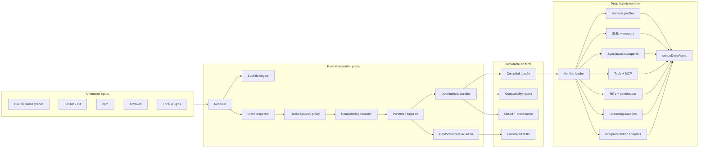
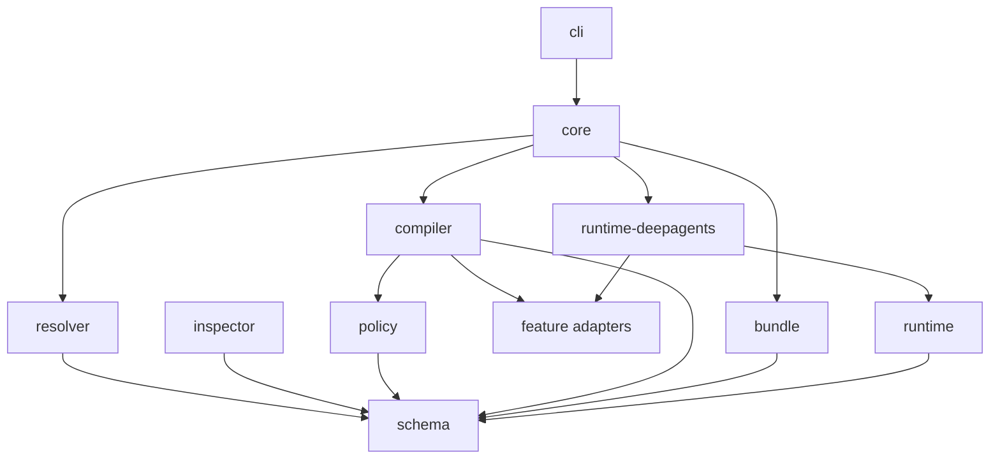
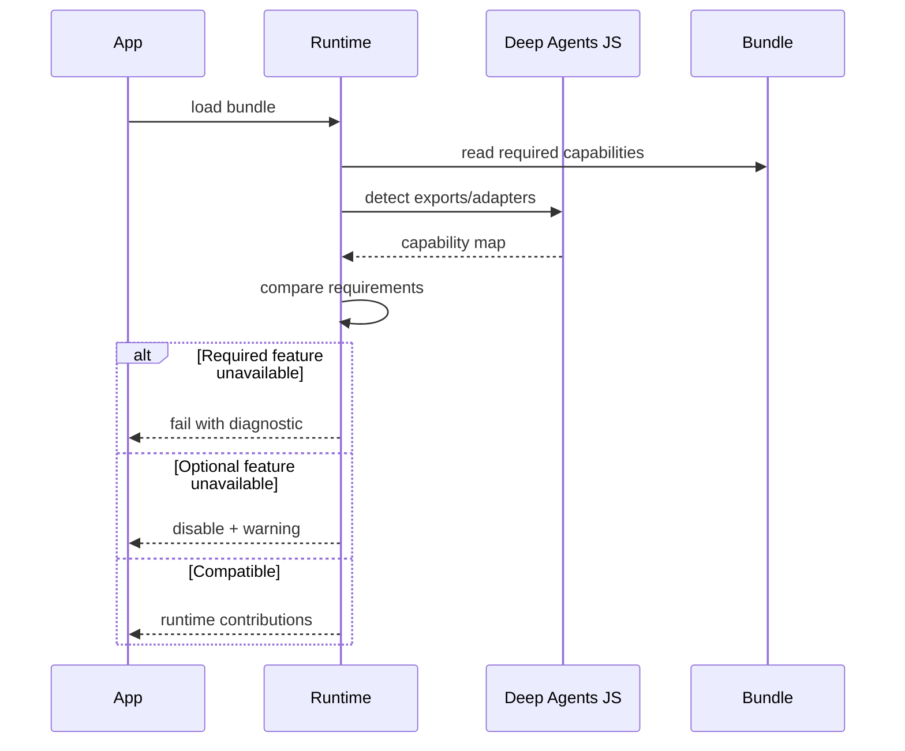
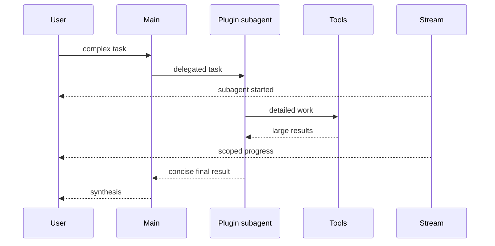
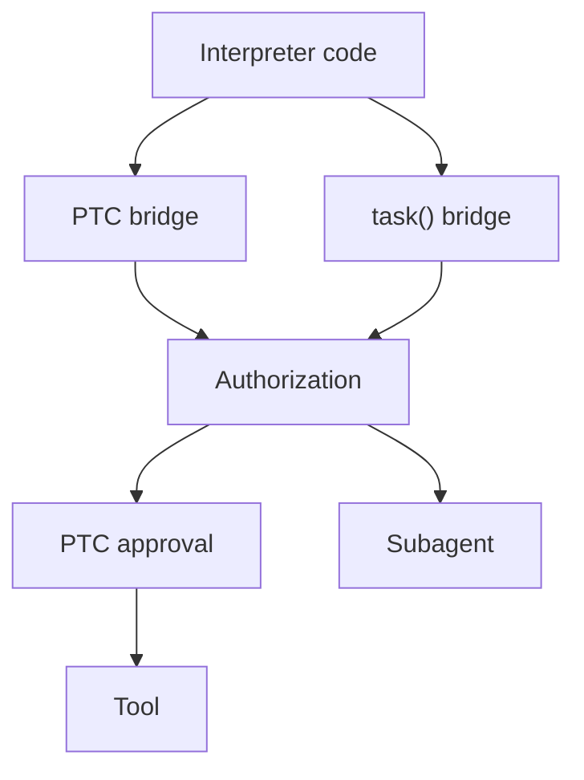
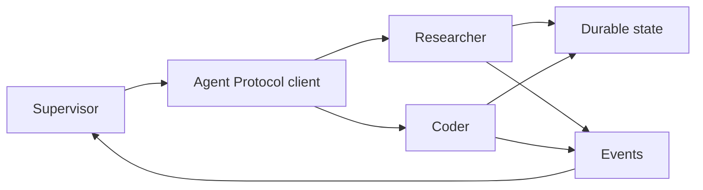
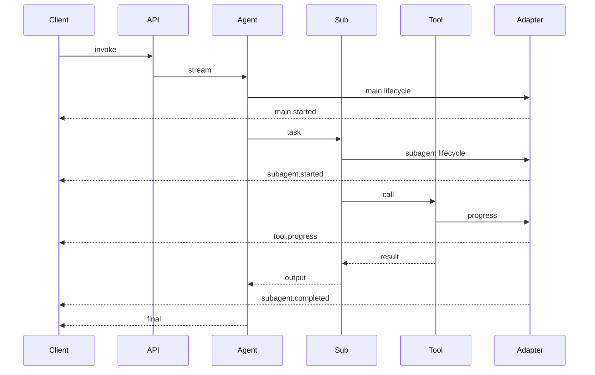
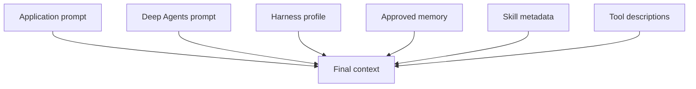
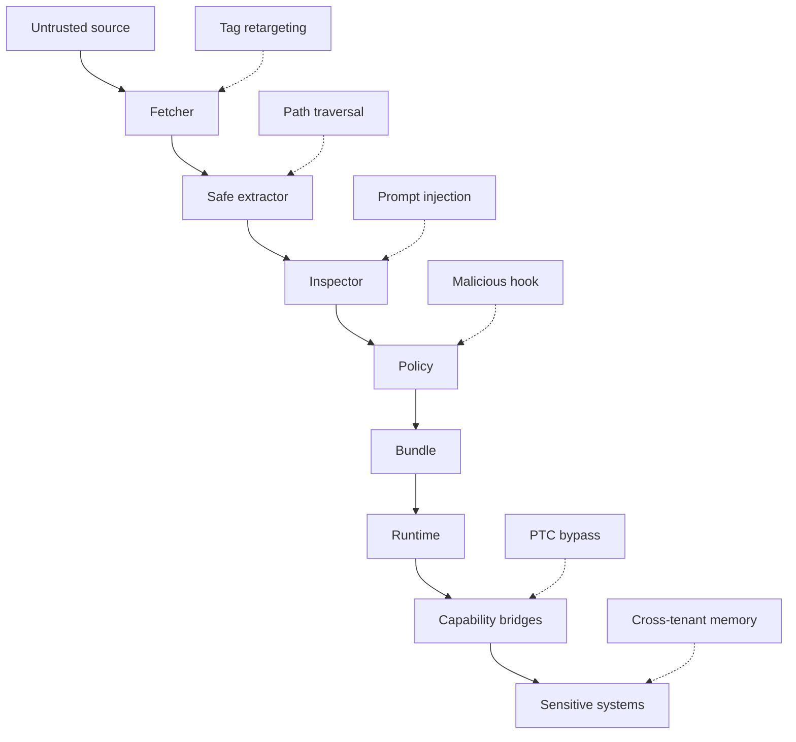

# RFC: Deep Agents Plugin Resolver, Compiler, and Runtime Integration for TypeScript

- **Status:** Proposed
- **Repository:** `yu-iskw/deepagents-plugin-resolver-ts`
- **Supersedes:** Initial Claude Code plugin resolver RFC
- **Target language:** TypeScript
- **Primary runtime:** Node.js
- **Primary agent framework:** Deep Agents JS
- **Primary deployment targets:** OCI containers, Google Cloud Run, Kubernetes
- **Last updated:** 2026-07-15

---

## 1. Executive Summary

This RFC proposes an expanded architecture for `deepagents-plugin-resolver-ts`: a build-time resolver, compatibility compiler, deterministic bundler, and runtime integration layer that allows TypeScript applications built with Deep Agents JS to consume compatible Claude Code plugins and plugin marketplaces.

The project should bridge two distinct extension systems:

1. **Claude Code plugins**, which distribute skills, commands, agents, hooks, MCP servers, settings, language-server definitions, monitors, binaries, and supporting assets.
2. **Deep Agents**, which assembles an agent harness from skills, memory, middleware, profiles, synchronous and asynchronous subagents, filesystem backends, permissions, human-in-the-loop controls, streaming, persistence, and optional interpreter or rubric capabilities.

The recommended architecture preserves a strict build-time/runtime boundary:



The central rule is:

> **Resolve, inspect, pin, validate, and compile untrusted plugins before deployment. At runtime, load only immutable, integrity-verified, policy-approved descriptors and assets.**

The expanded design adds support or explicit extension points for:

- Deep Agents harness profiles;
- skills and procedural memory;
- persistent memory;
- context engineering and isolation;
- synchronous subagents;
- dynamic subagent orchestration;
- asynchronous Agent Protocol subagents;
- interpreter and programmatic-tool-calling policies;
- human-in-the-loop approvals;
- event and token streaming;
- rubric-based runtime and build-time evaluation;
- provider/model-specific adaptation;
- Cloud Run-compatible immutable deployment.

Harness profiles improve model-specific adaptation but do not replace source resolution, portable IR, policy, authorization, or deterministic bundling.

---

## 2. Intent and Issue Analysis

### 2.1 Stated Problem (X)

Developers want to use Claude Code plugins and marketplaces from Deep Agents JS applications. Applications may run in immutable containers such as Cloud Run, and the integration should additionally use the wider Deep Agents feature set.

### 2.2 Underlying Intent (Y)

The actual goal is a reusable TypeScript extension platform that:

- reuses existing plugin ecosystems;
- exposes capabilities through Deep Agents idioms;
- remains provider-agnostic;
- supports long-running and delegated workflows;
- offers streaming and frontend integration;
- enables human approval and governance;
- preserves context efficiently;
- supports deterministic deployments;
- prevents plugins becoming uncontrolled code-execution or authorization boundaries;
- evolves as Deep Agents gains features.

### 2.3 XY Problem Check

A naive implementation would be:

```text
marketplace -> download -> copy into image -> pass directory as skills
```

That handles only the easiest subset. It fails to address:

- Claude agents versus Deep Agents subagents;
- lifecycle-specific command hooks;
- MCP authorization and credentials;
- commands as explicit entry points;
- harness profiles as provider/model overlays;
- interpreter PTC bypassing ordinary approval paths;
- async subagents requiring Agent Protocol services;
- provenance-aware streaming;
- memory lifecycle and scope;
- rubric loops affecting cost and control flow.

Therefore the project must be a **compatibility compiler and runtime composition layer**, not a downloader.

---

## 3. Deep Agents Research Findings

### 3.1 Current Deep Agents JS assembly

The current TypeScript `createDeepAgent` surface supports an opinionated middleware stack and parameters for:

- model;
- tools;
- structured system prompt;
- state schema;
- custom middleware;
- sync and async subagents;
- response format;
- runtime context schema;
- checkpointer;
- store;
- filesystem backend;
- `interruptOn`;
- memory;
- skills;
- permissions;
- stream transformers.

It also resolves provider/model harness profiles during assembly.

**Implication:** the runtime should expose typed contributions rather than hide all behavior behind one opaque factory.

### 3.2 Skills

Skills use progressive disclosure:

1. Metadata is exposed first.
2. Full `SKILL.md` is read only when relevant.
3. Supporting references are loaded on demand.

| Mechanism | Purpose                      | Loading              |
| --------- | ---------------------------- | -------------------- |
| Skills    | On-demand procedures         | Progressive          |
| Memory    | Persistent knowledge/context | Startup or on-demand |
| Tools     | Programmatic actions         | Tool-call path       |

**Implication:** imported skills remain skills; do not flatten them into the system prompt.

### 3.3 Memory

Deep Agents supports filesystem-backed long-term memory controlled by backends. Memory may be agent-, user-, tenant-, or organization-scoped, and may be read-only or writable. Short-term state belongs to graph checkpoints; long-term memory belongs to persistent stores/backends.

**Implication:** plugin static memory and application-owned writable memory must remain separate.

### 3.4 Context engineering

Deep Agents context includes:

- startup input context;
- runtime context;
- custom state;
- offloading and summarization;
- context isolation through subagents;
- persistent long-term memory.

Every imported component should declare lifecycle:

```text
always-loaded | on-demand | per-invocation | per-thread |
per-user | per-tenant | persistent | subagent-only
```

### 3.5 Harness profiles

Harness profiles tune a provider or model by changing:

- base prompt;
- prompt suffix;
- tool descriptions;
- excluded tools;
- excluded middleware;
- additional middleware;
- general-purpose subagent settings.

Profiles are model-oriented overlays, not security policy.

### 3.6 Synchronous subagents

Sync subagents isolate context and return concise final results. Claude agent Markdown can map to sync Deep Agents subagents when prompts, tools, models, skills, memory, and HITL settings are passed through host policy.

### 3.7 Interpreters and dynamic subagents

The Python documentation describes a QuickJS interpreter providing:

- in-memory JavaScript;
- loops, branching, retries, transforms, and parallel batches;
- optional programmatic tool calling (PTC);
- `task()` dispatch for configured subagents;
- thread, turn, or call persistence.

External capabilities cross the interpreter boundary only through explicit bridges. PTC is a separate permission boundary and documented Python behavior warns that ordinary per-tool `interrupt_on` approval is not necessarily enforced for PTC calls.

**Implication:** PTC needs its own authorization and approval path.

### 3.8 Async subagents

Async subagents:

- return a task ID immediately;
- run independently;
- support status, updates, and cancellation;
- retain state in their own thread;
- communicate through Agent Protocol;
- can be local/co-deployed or remote.

A Markdown agent definition alone cannot create durable async execution.

### 3.9 Streaming

Deep Agents supports graph updates, messages/tokens, tool calls, subagent namespaces, nested work, custom projections, and stream transformers.

**Implication:** runtime events should include stable plugin/component provenance.

### 3.10 Human-in-the-loop

HITL uses tool-level interrupt rules and checkpointing. Decisions may include approve, edit, reject, or respond. Subagents may have their own stricter interrupt rules.

### 3.11 Rubrics

Python `RubricMiddleware` uses an LLM-as-a-judge loop that can revise output until criteria pass or an iteration limit is reached.

**Implication:** plugins may ship rubric templates, but runtime activation remains application-owned.

---

## 4. Goals

### Functional

1. Resolve marketplaces, GitHub, Git, npm, local paths, archives, and later OCI artifacts.
2. Pin mutable references to immutable identities.
3. Inspect plugins without execution.
4. Compile compatible capabilities into portable IR.
5. Produce runtime contributions for:
   - skills;
   - memory;
   - sync subagents;
   - async subagents;
   - MCP;
   - middleware;
   - profiles;
   - HITL;
   - permissions;
   - streaming;
   - interpreter policies;
   - rubric templates.
6. Bundle all approved assets deterministically.
7. Generate compatibility, security, provenance, and evaluation artifacts.
8. Detect installed Deep Agents JS capabilities.

### Security

- no runtime source resolution by default;
- no implicit plugin JS import;
- no lifecycle scripts during inspection;
- no unrestricted binaries;
- no profile-driven authorization bypass;
- no PTC without explicit allowlist;
- no writable organization memory by default;
- no embedded secrets;
- no cross-tenant context leakage;
- no unapproved remote Agent Protocol endpoint;
- no hidden command hooks.

### Quality

- stable TypeScript APIs;
- serializable IR;
- minimal runtime dependencies;
- explicit beta/preview gates;
- deterministic output;
- adversarial tests;
- Cloud Run and Kubernetes examples.

---

## 5. Non-Goals

The project will not:

1. Embed Claude Code as the hidden runtime.
2. Guarantee complete Claude Code parity.
3. Reimplement every Python feature in TypeScript.
4. Treat Python docs as proof of JS support.
5. Execute arbitrary plugin JavaScript.
6. Run plugin install scripts.
7. Allow global registration through import side effects.
8. Infer policy from natural-language instructions.
9. Expose the host environment to plugin binaries.
10. Allow plugins to weaken authorization.
11. Run durable background tasks inside request-scoped Cloud Run instances.
12. Treat rubric success as a security guarantee.

---

## 6. Evaluated Approaches

| Approach                    | Fidelity | Security | Reproducibility | Deep Agents fit | Cloud fit | Maintainability | Extensibility |  Score |
| --------------------------- | -------: | -------: | --------------: | --------------: | --------: | --------------: | ------------: | -----: |
| Claude subprocess           |       95 |       38 |              58 |              45 |        35 |              42 |            50 |     52 |
| Runtime resolver            |       72 |       41 |              35 |              74 |        49 |              56 |            82 |     57 |
| Skills-only compiler        |       46 |       91 |              95 |              58 |        96 |              90 |            52 |     73 |
| Compatibility compiler      |       82 |       92 |              97 |              87 |        96 |              87 |            91 |     90 |
| Compiler + feature adapters |       91 |       93 |              97 |              96 |        96 |              89 |            97 | **94** |

**Decision:** build a compatibility compiler plus runtime feature adapters.

---

## 7. Package Architecture

```text
packages/
├── schema/
├── resolver/
├── inspector/
├── policy/
├── compiler/
├── bundle/
├── runtime/
├── runtime-deepagents/
├── adapter-skills/
├── adapter-memory/
├── adapter-subagents/
├── adapter-async-subagents/
├── adapter-mcp/
├── adapter-profiles/
├── adapter-hitl/
├── adapter-streaming/
├── adapter-interpreter/
├── adapter-rubric/
├── cli/
├── core/
└── testkit/
```

| Package              | Responsibility                          |
| -------------------- | --------------------------------------- |
| `schema`             | Config, lockfile, IR, diagnostics       |
| `resolver`           | Source and marketplace resolution       |
| `inspector`          | Static safe inspection                  |
| `policy`             | Trust, capability, approval decisions   |
| `compiler`           | Translation orchestration               |
| `bundle`             | Deterministic materialization           |
| `runtime`            | Framework-neutral loading               |
| `runtime-deepagents` | Deep Agents composition                 |
| Feature adapters     | Capability-specific translation/runtime |
| `cli`                | User commands                           |
| `core`               | Stable facade                           |
| `testkit`            | Fixtures and conformance                |



Build-time source clients must not leak into runtime packages.

---

## 8. Configuration

```yaml
apiVersion: deepagents.plugins/v2
kind: PluginSet

metadata:
  name: enterprise-agent-plugins

marketplaces:
  - name: anthropic-official
    source:
      type: github
      repository: anthropics/claude-plugins-official
      ref: main

plugins:
  - id: security-review@anthropic-official
    trustPolicy: third-party-restricted
    features:
      skills: enabled
      commands: enabled
      syncSubagents: enabled
      mcp: review
      hooks: disabled
      profiles: review
      memory: static-only
      interpreter: disabled
      asyncSubagents: disabled
      rubrics: templates-only

runtime:
  compatibilityMode: strict
  deepAgents:
    requiredVersion: '>=0.5.0'
    featurePolicy:
      beta: explicit
      preview: explicit

  context:
    maxPluginPromptChars: 30000
    maxLoadedMemoryChars: 20000
    collisionPolicy: qualify

  interpreter:
    enabled: false
    ptcDefault: deny

  asyncSubagents:
    allowedHosts:
      - agents.internal.example.com

  streaming:
    attachPluginProvenance: true
    redactToolArguments: true

output:
  directory: '.deepagents/plugins'
  emitSbom: true
  emitSarif: true
  emitConformanceTests: true
  reproducible: true
```

Use `trustPolicy`, not `policyProfile`, to avoid confusing security policy with Deep Agents harness profiles.

---

## 9. Lockfile

```json
{
  "lockfileVersion": 2,
  "resolverVersion": "0.2.0",
  "pluginSetDigest": "sha256:...",
  "plugins": [
    {
      "id": "security-review@anthropic-official",
      "source": {
        "type": "github",
        "repository": "example/security-review",
        "requestedRef": "v2",
        "resolvedCommit": "0123456789abcdef..."
      },
      "contentDigest": "sha256:...",
      "manifestDigest": "sha256:...",
      "detectedCapabilities": ["skills", "commands", "sync-subagents", "mcp"],
      "compilerProfile": "claude-plugin-v2026-07",
      "approvalDigest": "sha256:..."
    }
  ]
}
```

Rules:

- Git refs resolve to full SHAs.
- npm ranges resolve to exact versions and registry integrity.
- archives require SHA-256.
- approvals bind to content digest.
- new detected capabilities require review.
- frozen builds fail on semantic-resolution drift.

---

## 10. Portable Plugin IR

```ts
export interface CompiledPluginSetV2 {
  schemaVersion: '2.0';
  compiler: CompilerIdentity;
  pluginSetDigest: string;

  plugins: CompiledPlugin[];
  skills: CompiledSkill[];
  memorySources: CompiledMemorySource[];
  commands: CompiledCommand[];
  syncSubagents: CompiledSyncSubagent[];
  asyncSubagents: CompiledAsyncSubagent[];
  mcpServers: CompiledMcpServer[];
  hooks: CompiledHook[];
  harnessProfiles: CompiledHarnessProfile[];
  hitlPolicies: CompiledHitlRecommendation[];
  permissions: CompiledPermission[];
  interpreterPolicies: CompiledInterpreterPolicy[];
  rubricTemplates: CompiledRubricTemplate[];
  streamMetadata: CompiledStreamMetadata[];
  assets: CompiledAsset[];

  diagnostics: CompatibilityDiagnostic[];
  provenance: ProvenanceRecord[];
}
```

```ts
export type CompatibilityStatus =
  | 'native'
  | 'translated'
  | 'partial'
  | 'unsupported'
  | 'blocked-by-policy'
  | 'runtime-unavailable'
  | 'requires-adapter'
  | 'requires-approval';
```

`runtime-unavailable` prevents Python-documented capabilities from being falsely represented as JS-supported.

---

## 11. Runtime Capability Negotiation

```ts
export interface DeepAgentsCapabilities {
  version?: string;
  skills: boolean;
  memory: boolean;
  harnessProfiles: boolean;
  syncSubagents: boolean;
  asyncSubagents: boolean;
  interruptOn: boolean;
  permissions: boolean;
  streamTransformers: boolean;

  interpreter: {
    available: boolean;
    implementation?: string;
    ptc: boolean;
    dynamicSubagents: boolean;
  };

  rubric: {
    available: boolean;
    implementation?: string;
  };

  eventStreaming: {
    langGraphV2: boolean;
    subagentProjection: boolean;
  };
}
```



Detection should inspect actual exported APIs and registered adapters, not rely only on version strings.

---

## 12. Skills

```ts
export interface CompiledSkill {
  id: string;
  pluginId: string;
  originalName: string;
  runtimeName: string;
  description: string;
  root: string;
  skillFile: string;
  allowedTools?: string[];
  requiredPermissions?: string[];
  contextBudget?: {
    metadataChars: number;
    bodyChars: number;
  };
}
```

Bundle layout:

```text
skills/<plugin-namespace>/<skill-name>/SKILL.md
```

Rules:

- preserve progressive disclosure;
- validate frontmatter;
- keep references within bundle;
- record external references;
- avoid deep reference chains;
- qualify collisions;
- allow subagent-specific assignment.

---

## 13. Memory

```ts
export interface CompiledMemorySource {
  id: string;
  pluginId: string;
  path: string;
  kind: 'static-instructions' | 'procedural' | 'episodic-template' | 'organization-template';
  loadMode: 'startup' | 'on-demand';
  scope: 'agent' | 'user' | 'tenant' | 'organization';
  access: 'read-only' | 'read-write';
  writableLocationRef?: string;
}
```

Default policy:

| Source                           | Scope        | Access                 |
| -------------------------------- | ------------ | ---------------------- |
| Third-party plugin memory        | Agent        | Read-only              |
| Internal static memory           | Agent/tenant | Read-only              |
| User memory                      | User         | Application-controlled |
| Organization memory              | Organization | Application-controlled |
| Plugin-requested writable memory | None         | Deny                   |

Plugins may ship schemas or consolidation procedures, but persistent stores remain application-owned.

---

## 14. Harness Profiles

```ts
export interface CompiledHarnessProfile {
  pluginId: string;
  registrationKey: string;
  priority: number;
  config: {
    baseSystemPrompt?: string;
    systemPromptSuffix?: string;
    toolDescriptionOverrides?: Record<string, string>;
    excludedTools?: string[];
    excludedMiddleware?: string[];
    generalPurposeSubagent?: {
      enabled?: boolean;
      description?: string;
      systemPrompt?: string;
    };
  };
}
```

Arbitrary middleware cannot be serialized; profiles reference application-installed adapters.

Governance:

| Field                                  | Third-party default |
| -------------------------------------- | ------------------- |
| Base prompt replacement                | Deny                |
| Prompt suffix                          | Review              |
| Override plugin-owned tool description | Allow               |
| Override application tool description  | Deny                |
| Exclude plugin-owned tool              | Allow               |
| Exclude application tool               | Deny                |
| Exclude middleware                     | Deny                |
| Add middleware                         | Registered adapter  |
| Change GP subagent                     | Deny                |

Merge order:

```text
Deep Agents built-in
-> organization profile
-> compiled plugin fragments
-> application plugin overrides
-> direct application configuration
```

Application security always wins.

---

## 15. Synchronous Subagents

```ts
export interface CompiledSyncSubagent {
  id: string;
  pluginId: string;
  name: string;
  description: string;
  systemPrompt: string;
  modelRef?: string;
  toolRefs: string[];
  skillRefs: string[];
  memoryRefs: string[];
  middlewareAdapterRefs: string[];
  interruptPolicyRef?: string;
  responseSchema?: JsonSchema;
}
```

```text
effective tools =
  requested
  ∩ runtime-available
  ∩ trust policy
  ∩ principal authorization
  ∩ subagent HITL
  ∩ profile visibility
```



---

## 16. Interpreters and Dynamic Subagents

```ts
export interface CompiledInterpreterPolicy {
  pluginId: string;
  enabled: boolean;
  persistence: 'thread' | 'turn' | 'call';
  memoryLimitBytes: number;
  timeoutMs: number;
  maxResultChars: number;
  ptcTools: string[];
  dynamicSubagents: string[];
}
```

PTC is an independent capability path:



Requirements:

- explicit allowlist;
- no default filesystem/network/shell;
- per-principal authorization;
- independent PTC approvals;
- loop, memory, result, timeout, and concurrency limits;
- same-process QuickJS is not a host-isolation boundary;
- untrusted workloads run in isolated workers.

TypeScript strategy:

1. compile framework-neutral descriptors;
2. use registered adapters when available;
3. emit `runtime-unavailable` otherwise;
4. never substitute Node.js `eval`.

---

## 17. Async Subagents

```ts
export interface CompiledAsyncSubagent {
  id: string;
  pluginId: string;
  name: string;
  description: string;
  graphId: string;
  transport: 'co-deployed' | 'http';
  endpointRef?: string;
  authProfile?: string;
  allowedOperations: Array<'launch' | 'status' | 'update' | 'cancel'>;
  dataClassification?: string;
}
```



Policy:

- endpoint allowlist;
- TLS;
- OAuth/workload identity;
- tenant propagation;
- cancellation authorization;
- bounded lifetime;
- audit updates;
- no embedded bearer tokens;
- approval for external egress.

---

## 18. MCP

```ts
export interface CompiledMcpServer {
  id: string;
  pluginId: string;
  transport: 'streamable-http' | 'sse' | 'stdio';
  endpointRef?: string;
  executableAssetRef?: string;
  args?: string[];
  environmentRefs?: string[];
  authProfile?: string;
  toolAllowlist?: string[];
  startup: 'lazy' | 'eager';
}
```

Preference:

1. Streamable HTTP;
2. managed/co-deployed MCP;
3. SSE compatibility;
4. sandboxed stdio.

Every tool is wrapped with authorization, tenant context, timeout, limits, telemetry, provenance, and optional HITL.

---

## 19. Human-in-the-Loop

```ts
export interface CompiledHitlRecommendation {
  pluginId: string;
  toolRef: string;
  risk: 'low' | 'medium' | 'high' | 'critical';
  recommendedDecisions: Array<'approve' | 'edit' | 'reject' | 'respond'>;
  conditionRef?: string;
}
```

Final rules:

```text
application mandatory
∪ organization policy
∪ plugin recommendations
∪ stricter subagent rules
```

Plugins cannot remove mandatory interrupts.

HITL requires a checkpointer, stable thread IDs, durable resumption, decision audit, and timeout policy.

---

## 20. Streaming

```ts
export interface PluginRuntimeEvent<T = unknown> {
  schemaVersion: '1.0';
  timestamp: string;
  runId: string;
  threadId?: string;
  namespace: string[];

  source: {
    agent: 'main' | 'sync-subagent' | 'async-subagent';
    agentName?: string;
    pluginId?: string;
    componentId?: string;
  };

  type:
    | 'lifecycle'
    | 'message'
    | 'token'
    | 'tool-call'
    | 'tool-result'
    | 'interrupt'
    | 'rubric'
    | 'custom';

  data: T;
  redaction?: {
    applied: boolean;
    fields?: string[];
  };
}
```



Requirements:

- preserve LangGraph namespaces;
- attach plugin provenance;
- support nested subagents;
- distinguish sync/async;
- redact by policy;
- expose interrupts/rubrics;
- bounded buffering;
- cancellation.

---

## 21. Commands

```ts
export interface CompiledCommand {
  id: string;
  pluginId: string;
  name: string;
  description?: string;
  promptTemplate: string;
  argumentsSchema?: JsonSchema;
  requiredSkills?: string[];
  defaultRubricRef?: string;
}
```

Commands are explicit application entry points exposed through routes, slash commands, UI actions, jobs, or internal APIs. Do not load every command body into startup context.

---

## 22. Hooks and Middleware

```ts
export type PortableHookEvent =
  | 'beforeAgentInvoke'
  | 'afterAgentInvoke'
  | 'beforeToolCall'
  | 'afterToolCall'
  | 'onToolError'
  | 'beforeSubagentInvoke'
  | 'afterSubagentInvoke'
  | 'onInterrupt'
  | 'onRubricEvaluation';
```

```ts
export type CompiledHookAction =
  | { type: 'middleware-adapter'; adapterRef: string; config: unknown }
  | { type: 'webhook'; endpointRef: string }
  | { type: 'sandbox-command'; assetRef: string; args: string[] }
  | { type: 'unsupported'; reason: string };
```

| Action                        | Default |
| ----------------------------- | ------- |
| Registered pure middleware    | Allow   |
| Declarative policy middleware | Allow   |
| Webhook                       | Review  |
| Sandbox command               | Deny    |
| Shell string                  | Deny    |
| Imported JS module            | Deny    |

---

## 23. Rubrics and Evaluation

Two uses:

### Build-time conformance

Prefer deterministic tests for schema, capability mapping, references, and generated descriptors. LLM judging is supplementary.

### Runtime task rubrics

```ts
export interface CompiledRubricTemplate {
  id: string;
  pluginId: string;
  name: string;
  criteria: string[];
  recommendedGraderModel?: string;
  maxIterations?: number;
  dataPolicy?: {
    allowExternalGrader: boolean;
  };
}
```

Governance:

- disabled by default for third parties;
- explicit activation;
- host-controlled grader;
- iteration cap;
- data-classification checks;
- stream evaluation events;
- never replace tests or authorization.

---

## 24. Context Engineering

```ts
export interface ContextContribution {
  id: string;
  source: 'skill' | 'memory' | 'profile' | 'tool' | 'subagent' | 'rubric';
  loadMode: 'startup' | 'on-demand' | 'runtime';
  scope: 'main-agent' | 'subagent' | 'invocation' | 'thread' | 'user' | 'tenant';
  maxChars?: number;
  priority?: number;
  sensitive?: boolean;
}
```



Use:

- subagents for context quarantine;
- interpreters for deterministic in-memory orchestration;
- sandboxes for shell/OS execution;
- memory for persistent context;
- skills for on-demand procedures.

---

## 25. Permissions and Authorization

```ts
export interface RuntimeAuthorizationContext {
  principalId: string;
  tenantId?: string;
  pluginId: string;
  componentId: string;
  capability: string;
  operation: string;
  resource?: string;
  input?: unknown;
}
```

```text
effective permission =
  source trust
  ∩ capability policy
  ∩ application authorization
  ∩ tenant policy
  ∩ HITL decision
  ∩ execution-environment policy
```

Profiles and tool visibility are not authorization.

---

## 26. Cloud Run Deployment

```dockerfile
FROM node:24-bookworm-slim AS build
WORKDIR /workspace

COPY package.json pnpm-lock.yaml pnpm-workspace.yaml ./
RUN corepack enable && pnpm install --frozen-lockfile

COPY deepagents.plugins.yaml deepagents.plugins.lock.json ./
COPY plugin-policy.yaml ./
COPY packages ./packages
COPY src ./src
COPY tsconfig.json ./

RUN pnpm deepagents-plugins verify --frozen-lockfile
RUN pnpm deepagents-plugins compile     --frozen-lockfile     --reproducible     --output /workspace/.deepagents/plugins

RUN pnpm build
RUN pnpm deploy --filter app --prod /workspace/prod

FROM gcr.io/distroless/nodejs24-debian12:nonroot
WORKDIR /app

COPY --from=build /workspace/prod ./
COPY --from=build /workspace/.deepagents/plugins ./.deepagents/plugins

ENV NODE_ENV=production
ENV DEEPAGENTS_PLUGIN_DIR=/app/.deepagents/plugins

CMD ["dist/server.js"]
```

| Work                 | Runtime                   |
| -------------------- | ------------------------- |
| Normal sync request  | Cloud Run service         |
| Long async subagent  | Agent Protocol deployment |
| Memory consolidation | Cloud Run Job             |
| Untrusted sandbox    | Isolated worker/container |
| Durable monitor      | Worker                    |
| Remote MCP           | Separate service          |

Do not load arbitrary tenant code into a shared Node.js process.

---

## 27. Supply-Chain Security

Required:

- Git SHA pinning;
- exact npm version/integrity;
- archive hashes;
- safe extraction;
- no lifecycle scripts;
- SBOM;
- license detection;
- provenance;
- malware/secret scanning;
- executable digest verification;
- content-addressed cache;
- signed releases;
- digest-bound approvals;
- reproducible output;
- SHA-pinned GitHub Actions.

Bundle:

```text
.deepagents/plugins/
├── bundle-manifest.json
├── lock.json
├── compatibility-report.json
├── provenance.json
├── sbom.cdx.json
├── ir/plugin-set.json
├── profiles/harness-profiles.json
├── skills/
├── memory/
├── assets/
├── rubrics/
└── generated-tests/
```

---

## 28. Threat Model



| Threat               | Mitigation                 |
| -------------------- | -------------------------- |
| Mutable source       | Immutable pin              |
| Archive traversal    | Safe extraction            |
| Hidden executable    | Capability detection       |
| Prompt injection     | Treat content as untrusted |
| Profile override     | Field governance           |
| Tool escalation      | Authorization wrapper      |
| PTC bypass           | Separate PTC policy        |
| Async exfiltration   | Endpoint/data policy       |
| Memory poisoning     | Scope/write control        |
| Rubric loop abuse    | Iteration cap              |
| Stream leakage       | Redaction/provenance       |
| Cross-tenant context | Tenant-bound stores        |
| Interpreter escape   | Worker/container isolation |

---

## 29. CLI

```bash
deepagents-plugins init
deepagents-plugins add <plugin>
deepagents-plugins remove <plugin>
deepagents-plugins resolve
deepagents-plugins update [plugin]
deepagents-plugins inspect
deepagents-plugins validate
deepagents-plugins audit
deepagents-plugins compile
deepagents-plugins verify
deepagents-plugins capabilities
deepagents-plugins explain <plugin>
deepagents-plugins test
deepagents-plugins sbom
deepagents-plugins doctor
```

Flags:

```text
--frozen-lockfile
--offline
--policy <path>
--runtime deepagents-js
--runtime-version <version>
--strict
--allow-beta <feature>
--allow-preview <feature>
--emit-sarif
--emit-conformance-tests
--reproducible
```

---

## 30. Runtime API

```ts
import { createDeepAgent } from 'deepagents';
import {
  loadPluginBundle,
  createDeepAgentsContributions,
} from '@deepagents-plugins/runtime-deepagents';

const bundle = await loadPluginBundle({
  directory: process.env.DEEPAGENTS_PLUGIN_DIR!,
  verifyIntegrity: true,
});

const contributions = await createDeepAgentsContributions({
  bundle,
  authorization,
  secretResolver,
  capabilityPolicy,
  streamPolicy,
  middlewareAdapters,
});

contributions.registerHarnessProfiles();

const agent = createDeepAgent({
  model,
  tools: [...applicationTools, ...contributions.tools],
  skills: contributions.skillSources,
  memory: contributions.memorySources,
  subagents: [...contributions.syncSubagents, ...contributions.asyncSubagents],
  middleware: [...applicationSecurityMiddleware, ...contributions.middleware],
  interruptOn: mergeInterruptPolicies(mandatoryInterrupts, contributions.interruptRecommendations),
  permissions: mergePermissions(applicationPermissions, contributions.permissions),
  streamTransformers: contributions.streamTransformers,
  checkpointer,
  store,
  backend,
});
```

No import side effects. Applications explicitly register profiles, middleware, interpreter adapters, rubric adapters, and async transports.

---

## 31. Diagnostics

```text
DAP4207 runtime-unavailable

Plugin:
  code-review@anthropic-official

Component:
  interpreter.dynamic-subagents

Reason:
  The plugin requests interpreter-based task() orchestration, but the
  installed Deep Agents JS runtime does not expose a registered interpreter
  adapter with dynamic-subagent support.

Resolution:
  - install/register a compatible adapter;
  - disable the component; or
  - compile in standard mode and retain static subagents only.
```

Diagnostics include source, plugin, component, compatibility, policy rule, runtime capability, and remediation.

---

## 32. Testing

### Unit

- schemas;
- canonical JSON;
- hashing;
- source normalization;
- safe extraction;
- policies;
- profiles;
- skills;
- memory;
- subagents;
- MCP;
- HITL;
- streams;
- capability negotiation;
- deterministic output.

### Integration

- resolve marketplace/Git/npm;
- offline frozen rebuild;
- compile/load skills;
- invoke sync subagent;
- fake Agent Protocol async server;
- HITL checkpoint/resume;
- stream provenance;
- profile merging;
- memory isolation;
- interpreter unavailable/available paths;
- rubric activation;
- Cloud Run image.

### Security

- Zip Slip;
- symlink escape;
- Unicode/case collision;
- archive bomb;
- malformed YAML;
- command injection;
- npm lifecycle script;
- Git submodule escape;
- environment-secret abuse;
- PTC escalation;
- async redirect;
- cross-tenant memory;
- stream leakage;
- rubric infinite loop;
- bundle tampering.

### Evaluation

Each adapter should include deterministic conformance, representative tasks, optional rubric quality checks, latency/token benchmarks, and compatibility snapshots.

---

## 33. Versioning

Track separately:

1. Claude plugin input profile.
2. Marketplace schema profile.
3. Portable IR.
4. Bundle format.
5. Runtime adapter.
6. Deep Agents JS capability baseline.

Beta and preview features require explicit opt-in.

---

## 34. Delivery Plan

### Phase 0: Foundation

Schemas, diagnostics, deterministic utilities, packages, security fixtures, compatibility matrix.

### Phase 1: Resolver and Skills

Marketplace/Git/npm/local, lockfile, inspection, skills, commands, bundle, Cloud Run example.

### Phase 2: Core Deep Agents Integration

Memory, profiles, sync subagents, HITL recommendations, permissions, stream provenance, capability negotiation.

### Phase 3: MCP and Async Delegation

Remote/stdio MCP, Agent Protocol subagents, cancellation/update, durable events.

### Phase 4: Interpreter and Dynamic Orchestration

Adapter interface, PTC allowlists, dynamic subagents, independent authorization, resource limits.

### Phase 5: Rubrics and Evaluation

Rubric templates, runtime adapter, evaluation events, generated conformance, LangSmith integration.

### Phase 6: Enterprise Distribution

Signed bundles, OCI artifacts, private catalogs, policy bundles, approval workflows, provenance verification.

---

## 35. MVP Acceptance Criteria

The first production-usable release must:

1. declare marketplaces/plugins;
2. resolve and lock sources;
3. inspect without execution;
4. compile skills and commands;
5. compile compatible sync subagents;
6. generate harness-profile fragments;
7. emit HITL/permission recommendations;
8. produce a deterministic bundle;
9. verify integrity at runtime;
10. load into Deep Agents JS;
11. preserve skill progressive disclosure;
12. attach plugin provenance to streams;
13. bundle into Cloud Run;
14. diagnose unsupported Python-only/beta features;
15. generate SBOM, provenance, and compatibility reports.

Interpreter, async, and rubric capabilities may remain adapter-gated until stable JS support exists.

---

## 36. Decision Summary

The project will be a **Deep Agents compatibility compiler and runtime composition platform**.

It will:

- compile at build time;
- use immutable verified bundles;
- preserve skills and memory semantics;
- translate agents into sync subagents;
- support async only through approved Agent Protocol deployments;
- use harness profiles for model adaptation;
- keep authorization outside profiles;
- govern PTC separately;
- expose provenance-aware streaming;
- integrate HITL without weakening controls;
- support rubric templates under host governance;
- detect capabilities instead of assuming Python/JS parity;
- deploy cleanly to Cloud Run.

It will not execute plugin code implicitly, download in production, trust marketplaces, claim unavailable JS features, use profiles as security policy, or let plugin text grant capabilities.

---

## 37. References

### Deep Agents

- https://docs.langchain.com/oss/python/deepagents/interpreters
- https://docs.langchain.com/oss/python/deepagents/dynamic-subagents
- https://docs.langchain.com/oss/python/deepagents/event-streaming
- https://docs.langchain.com/oss/python/deepagents/streaming
- https://docs.langchain.com/oss/python/deepagents/skills
- https://docs.langchain.com/oss/python/deepagents/memory
- https://docs.langchain.com/oss/python/deepagents/context-engineering
- https://docs.langchain.com/oss/python/deepagents/profiles
- https://docs.langchain.com/oss/python/deepagents/subagents
- https://docs.langchain.com/oss/python/deepagents/async-subagents
- https://docs.langchain.com/oss/python/deepagents/human-in-the-loop
- https://docs.langchain.com/oss/python/deepagents/rubric
- https://reference.langchain.com/python/deepagents
- https://github.com/langchain-ai/deepagentsjs

### Plugins and protocols

- https://code.claude.com/docs/en/plugins
- https://code.claude.com/docs/en/plugin-marketplaces
- https://agentskills.io/specification
- https://modelcontextprotocol.io/specification
- https://github.com/langchain-ai/agent-protocol

### Deployment and supply chain

- https://cloud.google.com/run/docs/container-contract
- https://slsa.dev/spec/
- https://cyclonedx.org/
- https://spdx.dev/
- https://www.sigstore.dev/

---

## Appendix A: Component Compatibility Matrix

| Claude component   | Deep Agents target        |    Fidelity | Default               |
| ------------------ | ------------------------- | ----------: | --------------------- |
| Skill              | Skill                     |        High | Allow                 |
| Command            | Explicit command          |      Medium | Allow                 |
| Agent              | Sync subagent             | Medium-high | Review                |
| Agent + endpoint   | Async subagent            |      Medium | Review                |
| MCP HTTP           | Wrapped tools             | Medium-high | Review                |
| MCP stdio          | Sandboxed MCP             |      Medium | Deny                  |
| Middleware hook    | Registered adapter        |      Medium | Review                |
| Command hook       | Sandbox command           |         Low | Deny                  |
| Settings           | Advisory/profile fragment |         Low | Review                |
| LSP                | Optional adapter          |         Low | Deny                  |
| Monitor            | External worker           |         Low | Unsupported initially |
| Binary             | Sandboxed asset           |    Variable | Deny                  |
| Rubric             | Rubric template           |      Medium | Templates only        |
| Memory             | Read-only memory source   | Medium-high | Review                |
| Interpreter module | Registered adapter        |    Variable | Deny                  |

---

## Appendix B: Feature Maturity Matrix

| Feature                    | Python docs status | JS strategy              |
| -------------------------- | ------------------ | ------------------------ |
| Skills                     | Stable             | Native                   |
| Memory                     | Stable             | Native/capability detect |
| Context engineering        | Conceptual         | Runtime composition      |
| Profiles                   | Beta               | Native in current JS     |
| Sync subagents             | Stable             | Native                   |
| Async subagents            | Preview            | Capability detect        |
| HITL                       | Stable             | Native                   |
| Streaming                  | Stable             | LangGraph-native         |
| Event subagent projections | Beta               | Adapter/detect           |
| Interpreters               | Beta               | Registered adapter       |
| Dynamic subagents          | Beta               | Interpreter adapter      |
| Rubrics                    | Beta               | Registered adapter       |
| PTC                        | Beta               | Separate policy boundary |

---

## Appendix C: Compatibility Report Example

```text
Plugin: secure-review@marketplace
Digest: sha256:...

[NATIVE]
  skill secure-review/security-review

[TRANSLATED]
  agent secure-review/reviewer
  -> synchronous Deep Agents subagent

[TRANSLATED]
  profile anthropic
  -> prompt suffix and plugin-owned tool descriptions

[REQUIRES-APPROVAL]
  mcp github-enterprise
  -> Streamable HTTP with auth profile

[RUNTIME-UNAVAILABLE]
  interpreter dynamic fan-out
  -> no registered JS interpreter adapter

[BLOCKED-BY-POLICY]
  hook post-tool-upload
  -> command hook denied

[UNSUPPORTED]
  monitor build-log
  -> requires external worker
```

---

## Appendix D: Runtime Contributions

```ts
export interface DeepAgentRuntimeContributions {
  skillSources: string[];
  memorySources: string[];
  tools: unknown[];
  syncSubagents: unknown[];
  asyncSubagents: unknown[];
  middleware: unknown[];
  streamTransformers: Array<() => unknown>;
  permissions: unknown[];
  interruptRecommendations: Record<string, unknown>;
  harnessProfiles: CompiledHarnessProfile[];

  registerHarnessProfiles(): void;

  diagnostics: CompatibilityDiagnostic[];
  capabilities: DeepAgentsCapabilities;
}
```

---

**End of RFC**
