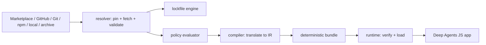

# Architecture overview

The system is a build-time control plane plus a minimal runtime loader
(RFC sections 1, 8, 11).



## Dependency direction

`runtime` never depends on Git clients, registry clients, or resolvers.
`schema` is environment-neutral. `core` aggregates the pipeline; `cli` wraps
`core`.

```text
schema ← policy ← compiler → adapter-mcp / adapter-hooks
schema ← resolver              runtime → adapter-mcp / adapter-hooks
core → resolver + compiler + runtime      cli → core
```

## Determinism (RFC 25)

- Canonical JSON (sorted keys, LF, trailing newline) for every hashed artifact.
- Sorted file ordering and normalized file modes in bundles.
- No timestamps in hashed artifacts; `build-info.json` (non-hashed) carries
  build time and is omitted entirely in `--reproducible` mode.
- Compiling the same inputs twice yields byte-identical bundles and equal
  `bundleDigest` values (covered by tests).

## Runtime invariants (RFC 18.3)

- No network resolution, npm installation, or Git operations.
- Bundle verification before use; fail closed on any digest mismatch.
- Plugins cannot escalate their own policy profile.
- Every plugin-derived tool passes through the host authorization wrapper.
