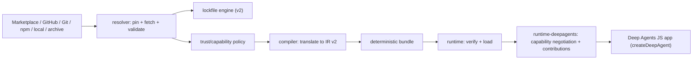

# Architecture overview

The system is a build-time control plane plus a minimal runtime loader and a
Deep Agents composition layer (RFC sections 1, 7, 11, 30).



## Packages

| Package              | Responsibility                                                    |
| -------------------- | ----------------------------------------------------------------- |
| `schema`             | Config, lockfile, IR v2, diagnostics, capability model            |
| `resolver`           | Source and marketplace resolution, lockfile v2, safe extraction   |
| `policy`             | Trust, capability, and approval decisions                         |
| `compiler`           | Translation orchestration and deterministic bundling              |
| `runtime`            | Framework-neutral verified loading                                |
| `runtime-deepagents` | Deep Agents capability detection and runtime contributions        |
| `adapter-mcp`        | MCP descriptors and authorization-wrapped tools                   |
| `adapter-hooks`      | Safe lifecycle hook translation                                   |
| `core`               | Stable facade over the pipeline                                   |
| `cli`                | User commands                                                     |
| `testkit`            | Fixtures and conformance                                          |

## Dependency direction

`runtime` never depends on Git clients, registry clients, or resolvers.
`schema` is environment-neutral. `core` aggregates the build pipeline;
`cli` wraps `core` and `runtime-deepagents`. `runtime-deepagents` builds on
`runtime` and has **no hard dependency on `deepagents`** — capabilities are
detected structurally from an injected or optionally imported module
(RFC section 11).

```text
schema ← policy ← compiler → adapter-mcp / adapter-hooks
schema ← resolver              runtime → adapter-mcp / adapter-hooks
runtime ← runtime-deepagents (optional peer: deepagents)
core → resolver + compiler + runtime      cli → core + runtime-deepagents
```

## Capability negotiation (RFC 11)

`runtime-deepagents` compares the bundle's required capabilities
(`requiredCapabilitiesFromIr`) against a detected `DeepAgentsCapabilities`
map. Missing required capabilities fail with a diagnostic (DAP4210); missing
optional capabilities disable the component with a warning. Interpreter,
async-subagent, and rubric contributions remain adapter-gated: without a
registered adapter they surface `runtime-unavailable` / `requires-adapter`
diagnostics instead of activating.

## Determinism (RFC 27)

- Canonical JSON (sorted keys, LF, trailing newline) for every hashed artifact.
- Sorted file ordering and normalized file modes in bundles.
- No timestamps in hashed artifacts; `build-info.json` (non-hashed) carries
  build time and is omitted entirely in `--reproducible` mode.
- Compiling the same inputs twice yields byte-identical bundles and equal
  `bundleDigest` values (covered by tests).

## Runtime invariants (RFC 5, 25)

- No network resolution, npm installation, or Git operations.
- Bundle verification before use; fail closed on any digest mismatch.
- Plugins cannot escalate their own trust policy.
- Every plugin-derived tool passes through the host authorization wrapper.
- Harness profiles are model overlays, never authorization; application
  security configuration always wins in the merge order (RFC 14).
- Plugin memory is read-only and agent-scoped by default; persistent stores
  remain application-owned (RFC 13).
